I wrote a resolution for the past two years on a different computer, but I think I forgot to commit them onto github. 
I was able to find a backup from when I first created the blog with Gatsby version2, but I had to upgrade everything that has changed in the past 3 years to version 5 of Gatsby... and I ended up overhauling the whole blog. 

## January
This was a crazy time. Sami and I had just signed our lease in Austin, Texas and I was coming back from a wedding in Tampa and flew straight to Colorado for a week-long snowboarding trip at Copper Mountain. 

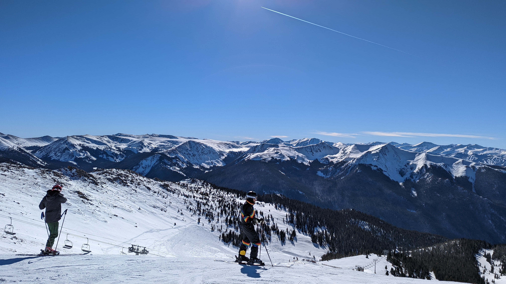

Then I flew back to LA for a couple of days, packed, and drove with my mom from LA to Austin over the course of 2 days. Thank you to everyone who contributed a song to the playlist, notably, "All my exes live in Texas". 

Some friends invited me to Meanwhile Brewery on January 22nd, and I get in line for BBQ and happen to make it into a shot of Somebody Feed Phil for the Austin episode. You can catch my blue puffer jacket for a split second on Netflix. 

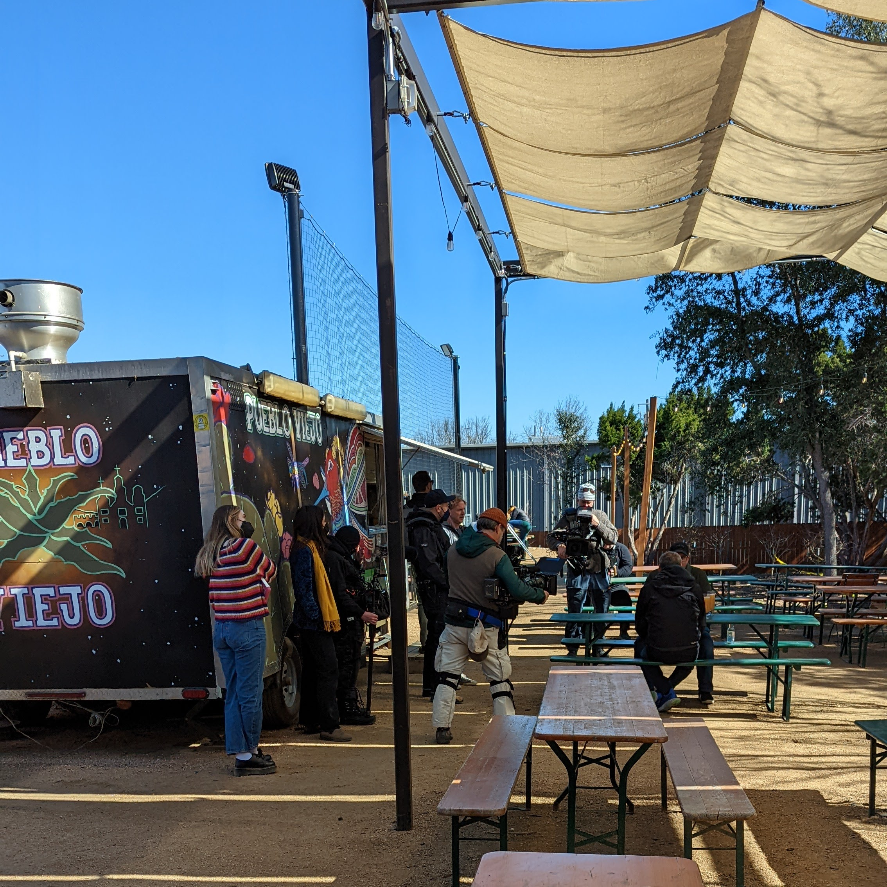

## February. 
Sami moved in we were busy setting up the apartment and meeting the doctors for our initial launch. 

We bought couches and I got a really nice lazyboy chair off of craigslist, but I hadn't been working out in a while, and when I leaned over to pick up the chair in the seller's house, my pants ripped right down the middle. Very awkward carrying it out.

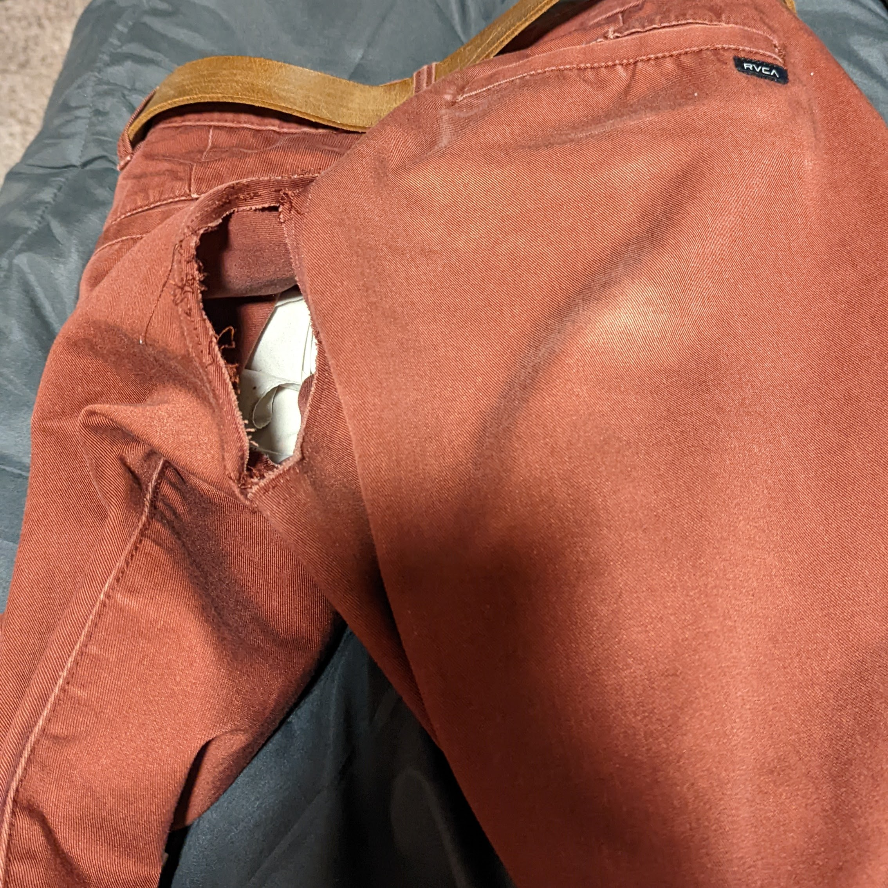

Our days were long and we worked 75-100 hour weeks because we had both our day jobs and the startup to build. 

## March
The weather warmed up and we got around to exploring the bars and downtown Austin. We left a little surprise on Rainey Street. 

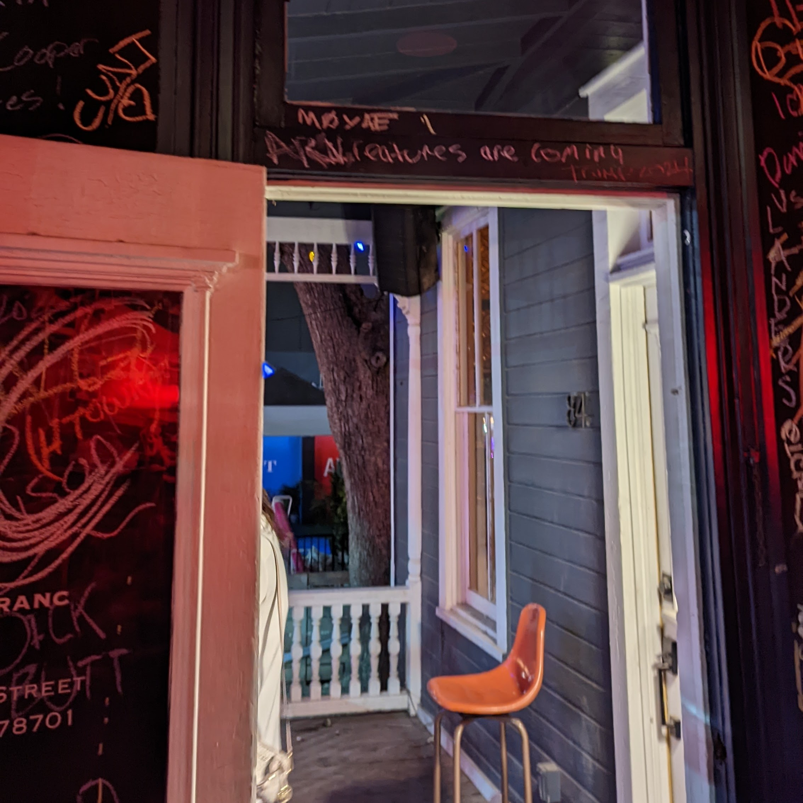

I started doing an hourly bootcamp session Monday, Tuesday, and Wednesday nights with James and Christine who were learning how to code. 

## April 
The doctors gave us access to their data and we took turns sleeping to work around the clock for our data job uploads. Some of the jobs in the early days took multiple days to run. 

I flew back into Virginia for a collegiate friend's wedding and was meeting up with some VA friends (Peter and Joyce) by Merrifield, when I coincidentally bumped into LA friends who happened to be in town to plan their own wedding! We were eventually joined by even more friends at Caboose, but what a nice surprise.

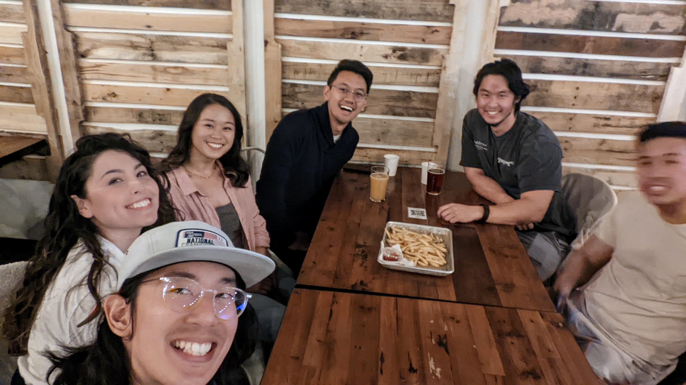

## May
Phat came and visited Austin. We did the Museuem of Ice Cream for a friend's birthday. 

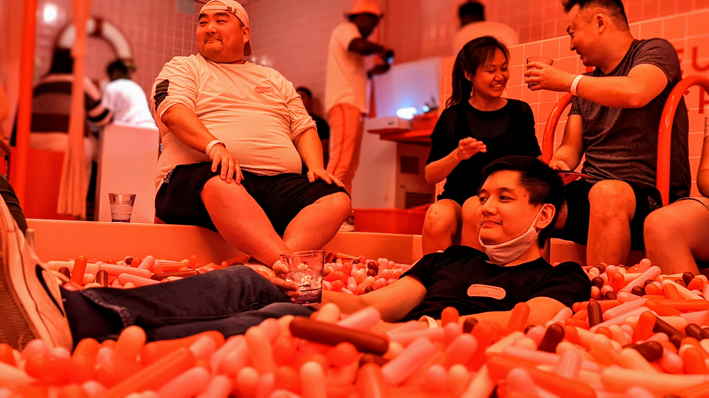

This was a picture taken before a bunch of paid actors took over the scene and started dancing suggestively when all we wanted to do was chill in the sprinkles.

Our first doctor agreed to do a paid trial with Moyae for a couple of months. 

The coding bootcamp sessions with me concludes and I think I did a bad job because none in my tutelage got a job. But also, the software job market was not looking great. Maybe just 4 hour of classes a week with office hours on Sunday was not enough. They were supposed to be doing 30 hours a week on their own, but it made me wonder what it was like for kids who had to endure online learning during quarantine. I'm sure I would've found a way to not pay attention. 

## June
AWS accepted Moyae into its impact accelerator and we were given $225K total value between grants and credits to build out Moyae even further. Everything up to this point was being funded out of our personal pockets. 

At the start of June, Sami and I flew to Seattle to attend the innaugral Amazon AWS accelerator and were treated to the best Seattle had to offer. 

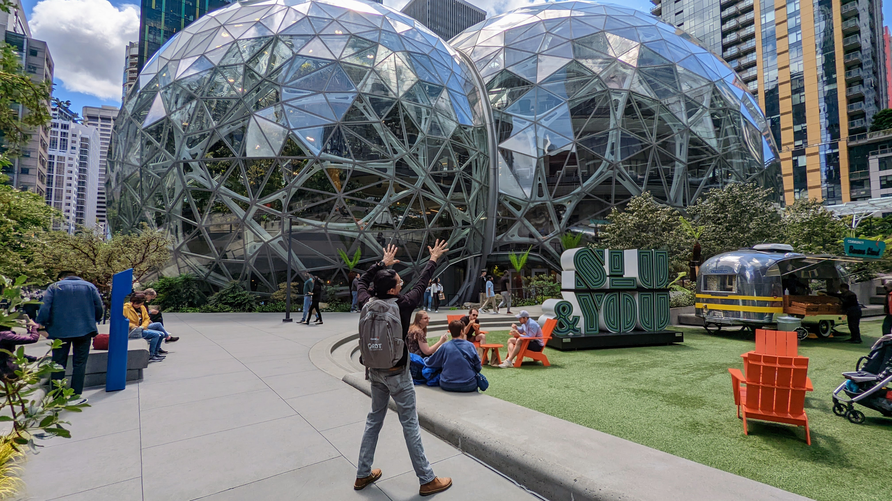

In order to thank Amazon for the opportunity, I had to pay my respects to.. ahem. Jeff Bezo's two magnficient eco-friendly spheres. I got to catch up with friends in town, went on a date at the space needle, and experienced box suites and courtside seats at a WNBA game. I also happened to make an appearance on ESPN for a moment too, but I was too awestruck being courtside to notice until someone pointed it out. 

There was also a wedding back in VA and I had to clean up for a weekend. 

I turned 32 and we celebrated by going out to Seoulju in Austin when I got back. However, celebrations were cut short because the first federal testing for Moyae was early in the morning the next day so I pulled a collegiate all nighter in a mad dash to be ready by 8am the next day. 

## July
The accelerator was an 8 week program and Sami had business calls and code to fix everyday. 

On July 16th, Honey Pig opened its doors in Austin, and I went to the opening week for a cousin's birthday. 
The owner from Annandale was there! She didn't recognize me, but I'd seen her enough times after college

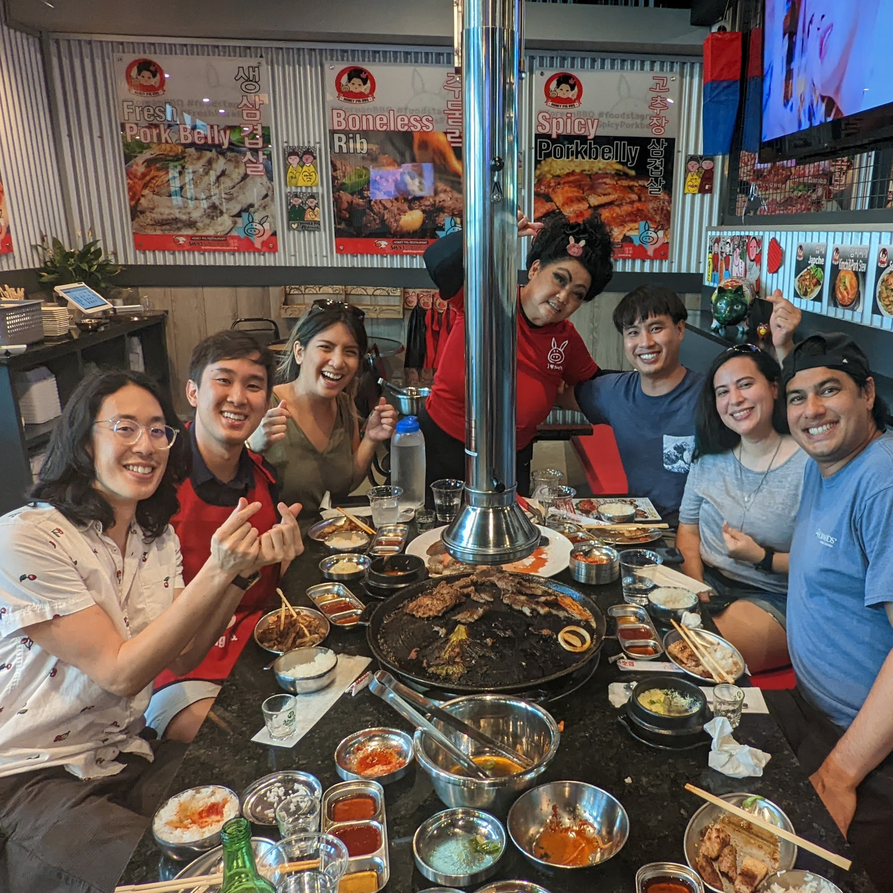

***

Towards the last week of July, Sami and I were flown to New York to do "Demo Day" to about a hundred VC's and angels that AWS had curated. 

There were a lot of restaurants and free food and networking and at some point during all the mayhem, I found myself at a table at Club Marquee on a Wednesday night. 

When the AWS program concluded with "yearbook" signings, I crashed Dennis's living room in Brooklyn. We went out that night and met up with an old co-worker from Entermedicare.

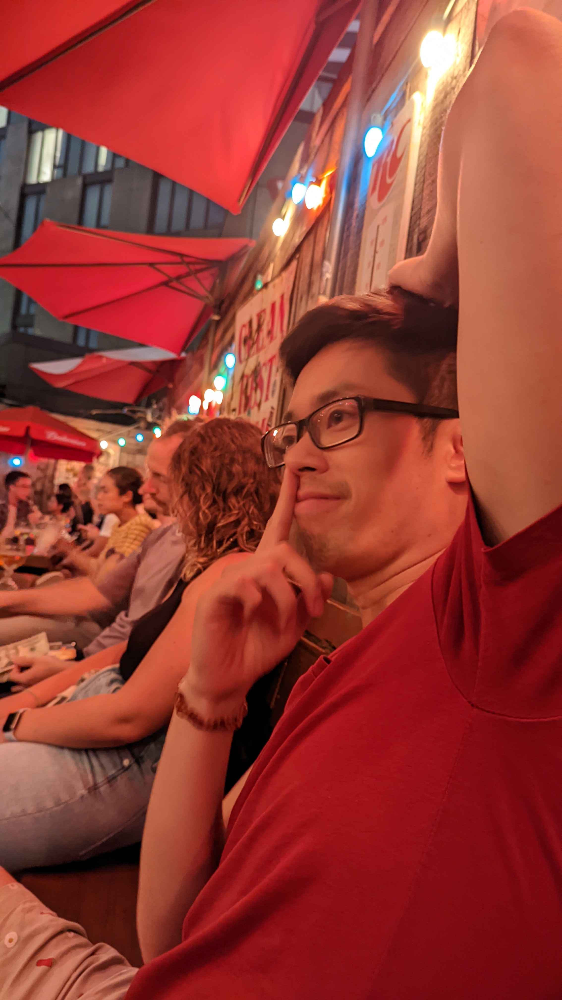
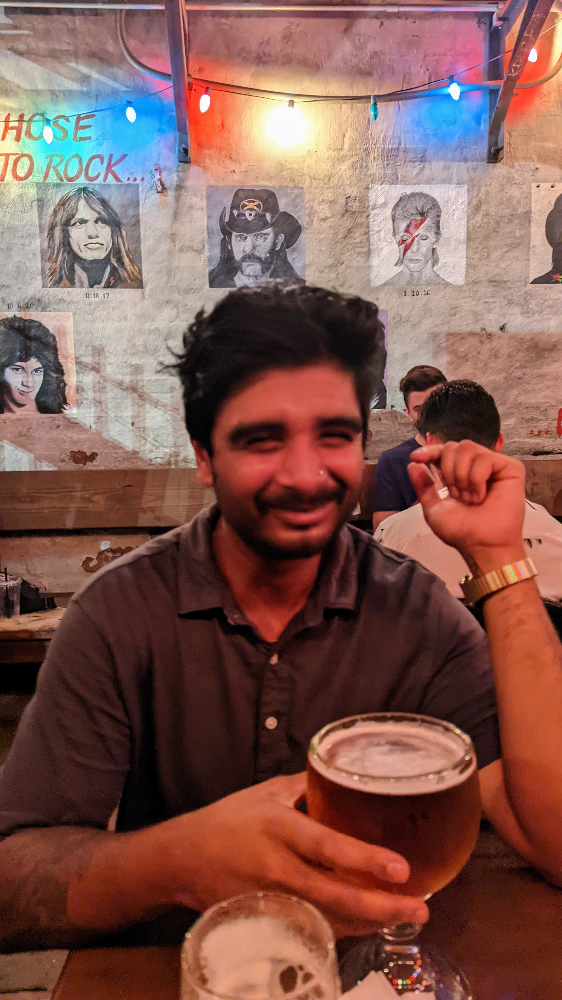

I borrowed Dennis's car early the next morning and drove 3 hours from NYC to Wildwood, NJ to play beach ultimate with the frisbee crew.

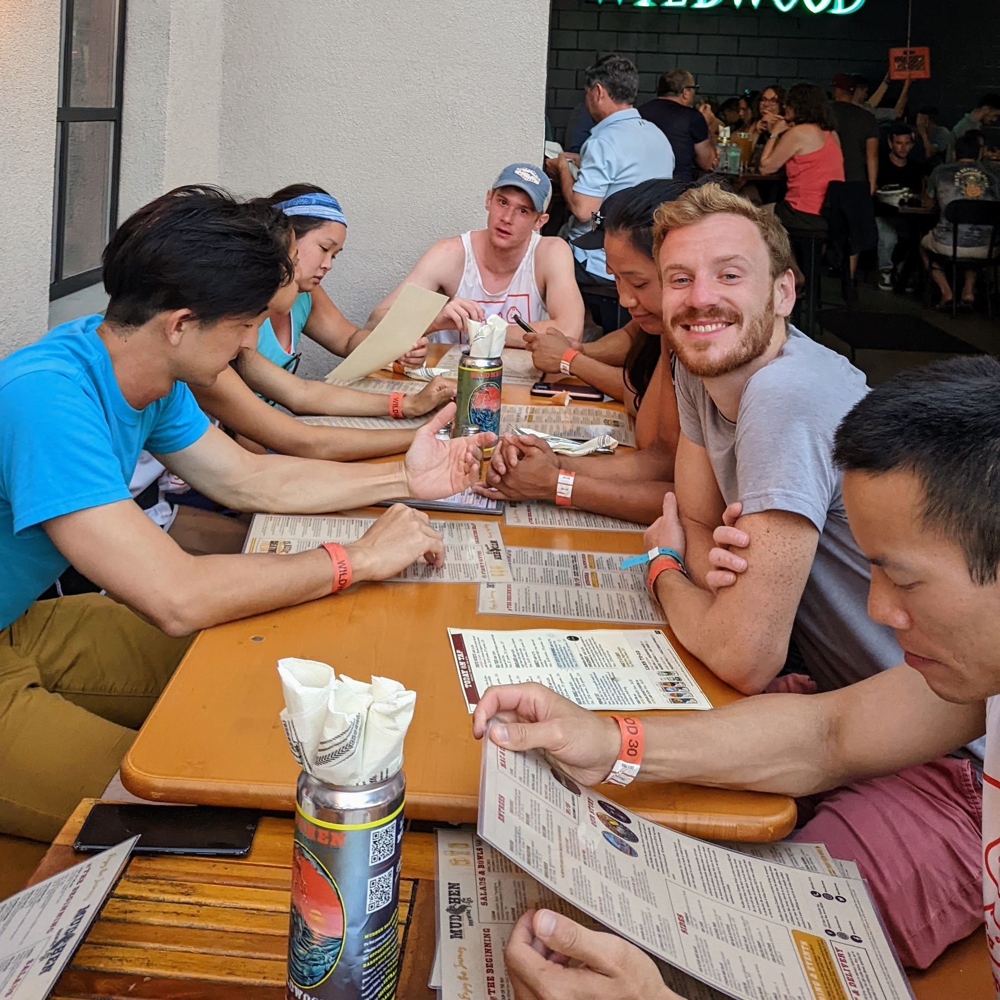

As I drove back into NYC that night, I managed to catch another friend who was visiting the city from VA one last time before his daughter was born. I was a bit too late to grab drinks, but we got meat skewers from a vendor in Chinatown and ate them at an empty park.

## August
The doctors were done with the paid trial and said that they needed our software to do twice as much. The medical side was looking good, but it was a pain to do billing translations from our app into their current old system. 

In order for them to switch, we needed to also build out revenue management and appointment scheduling. Easy enough we said.

Sami and planned out what our next 3 months would look like. 

I played in Austin's summer league and my team finished first in the tournament. This is probably my first win in 7 years. I think the last time I'd won a tournament was when we were trial testing Lord Club for Fairfax, and I didn't even try out when the team was made back then. 

Alex came and visited for a weekend and we got free fried ice cream for Sami's birthday. I have hardly any pictures from this month because we were so busy. Alex and I took a selfie and that was it for the entire month. 

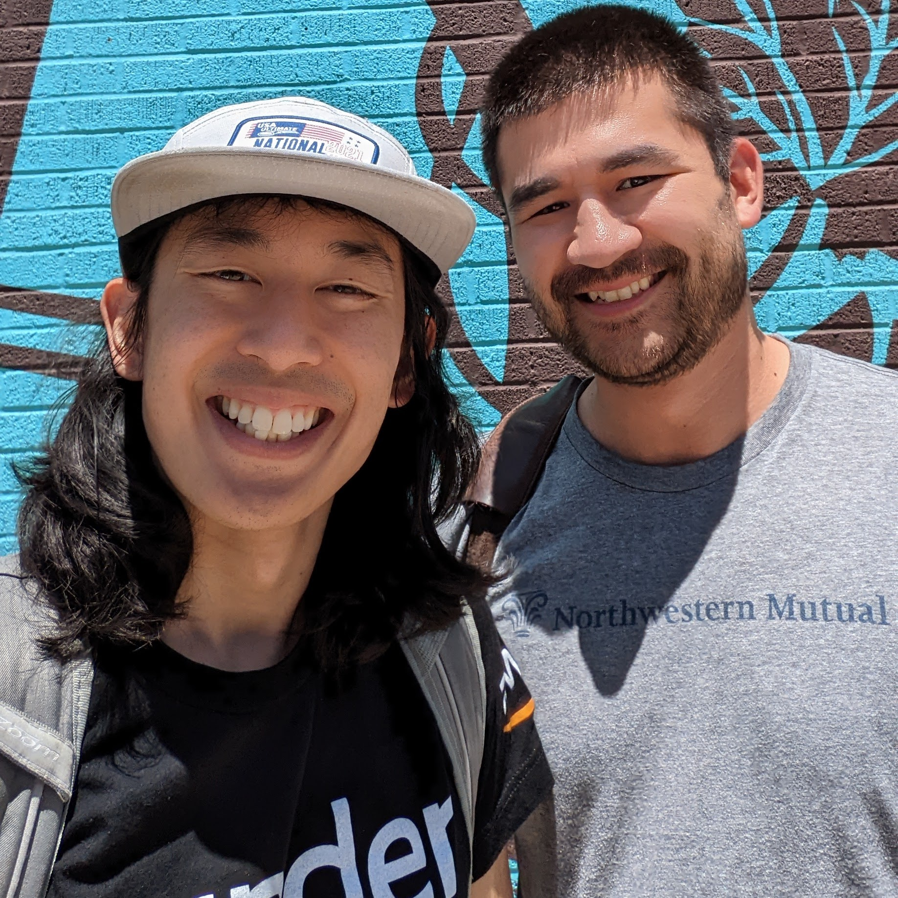

## September
I hadn't taken a weekend off since the Wildwood weekend and a couple hours off for a birthday dinner early in August so I bought tickets to LA for 3 days to visit some friends I said goodbye to when I moved. It was my first < 50hr week since end of July.

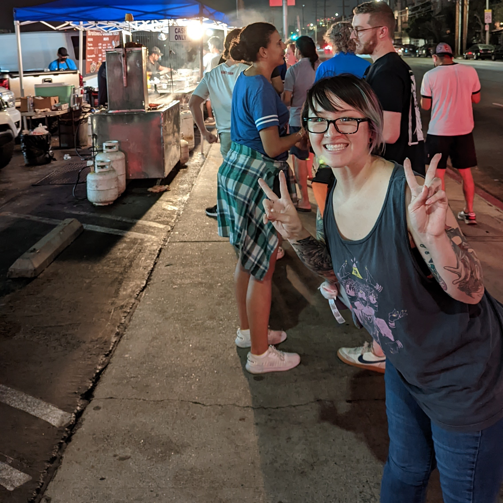
I missed these tacos. 

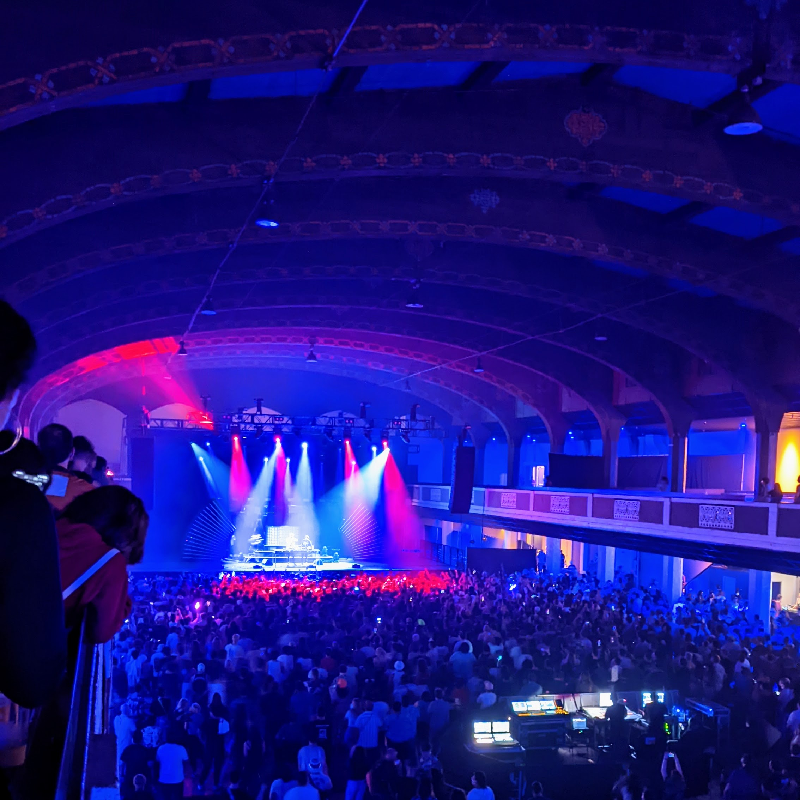

We danced a Yung Bae concert and we ate so many noodles, skewers, and tacos. I flew back to Austin on Monday morning.

Addison came to visit from Fredericksburg and while I had to work most of the day while he was in town, we still managed to do some exploring and a rage room. 

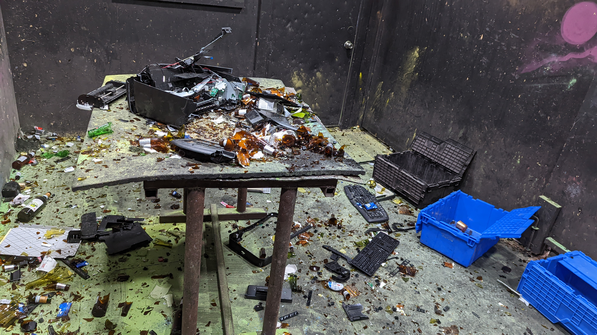
The printer had no chance. 

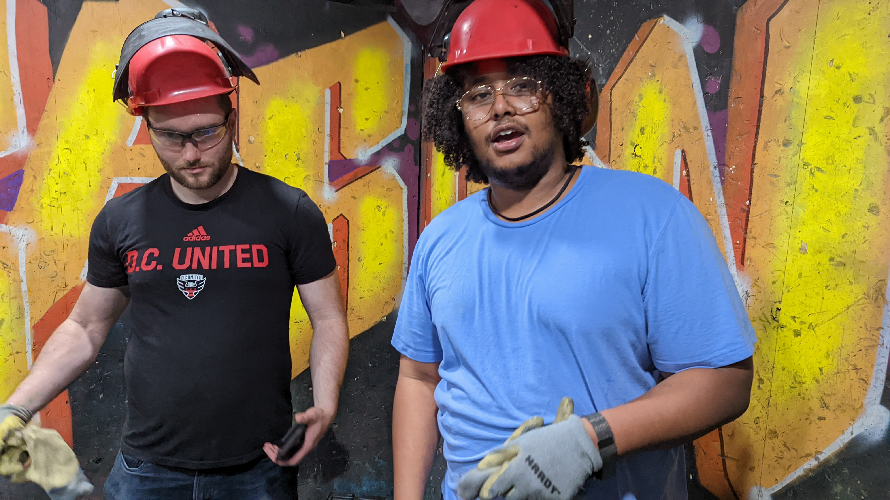
Against these guys.

At the end of September, Sami and I travelled to Chicago to AAO, the American Academy of Ophthalmology convention. It seemed like every ophthalmologist in the world was there, and the biggest players in the eye space had fancy booths. We learned McCormick Convention center was MASSIVE and got to demo to a few strangers. 

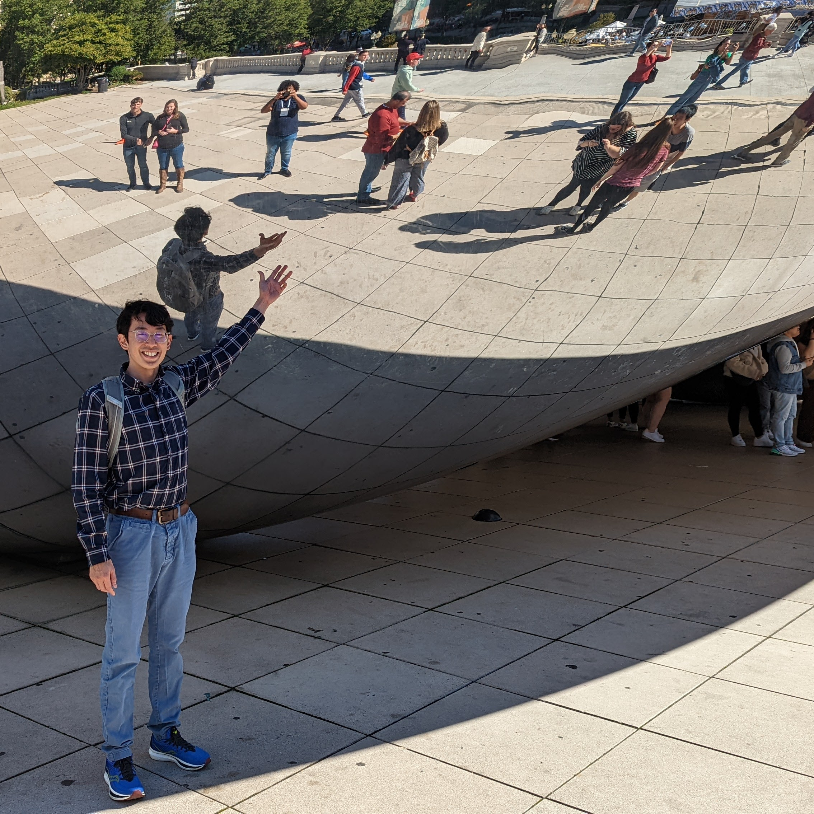
Here is a bean.

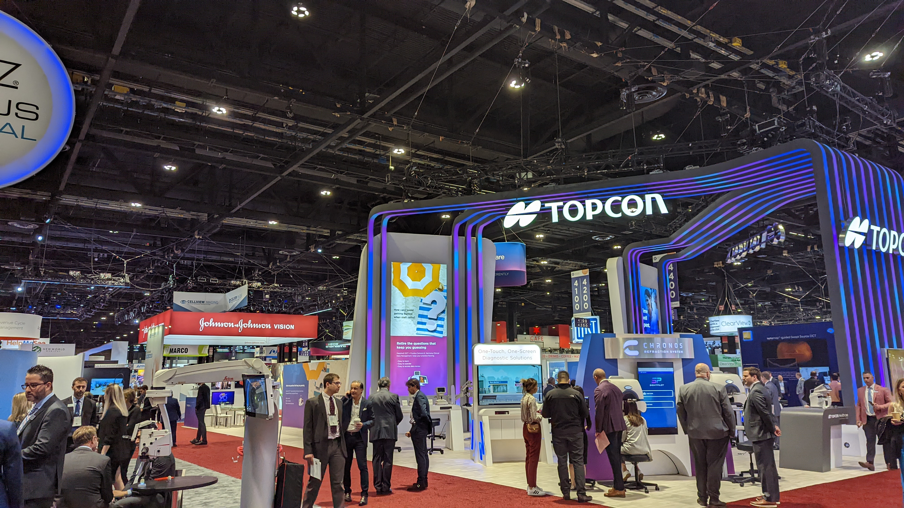
And this is what an eye doctor's dealers room looks like. I'd only ever been to anime and pop culture ones! 

I also bought a fish tank when I got back to Austin because I saw a deal on craigslist. so now I had a roommate: Bruce the Betta.

## October
I got to dogsit Nick, a very good boi, for a week while my cousin was out of town for a wedding. It was very hard to code for 3-4 hours at a time when someone wags their tail at you looking like this asking to play. 

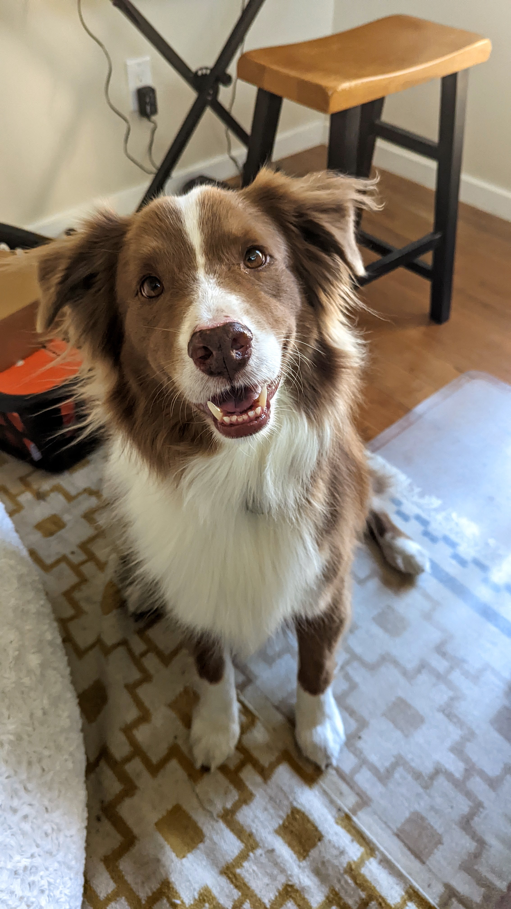

At the end of October I flew back to VA for a week to attend two weddings back to back and catch up with Virginia friends. I got completely obsessed with the anime Cyberpunk Edgerunners somewhere in the blur and could not stop listening to a soundtrack from the game / show "I really want to stay at your house" by Rosa Walton.

## November
November was a lot of preparation to certification ready for our December test dates. I did manage to sneak out and go to Wurstfest and eat bratwursts and drink german beer early in the morning.

A crazy coincidence also happened when I went to see Jimmy O Yang's netflix taping in Austin. Sami and I arrived 30 minutes late because of a bug for work, but the show was also delayed, so we got in on time. Our assigned seats just happened to be next to my cousins and their SO's at the paramount theatre. Sami thought we'd planned it, we were all very surprised and amused. 

Sami and I took Thanksgiving night off at a friend's place in Round Rock watching some old-fashioned American football and chicken from HEB. 

## December
I signed a new lease in Lamar by my rock climbing gym. I missed a lot of the asian eats from Ktown in LA so I wanted to be closer to some of the pochas that I liked... like SOHA bar. I forgot all about Cyberpunk Edgerunners when I started watching Arcane. I apologize to all the League fans I've offended over the years. 

## Goals and resolutions met
Since we are missing some context from the previous two years, one of my goals was to get stronger. I got back into rock climbing again early in the summer and started weight-lifting again. I was able hit my goal of 3-reps at 135lbs (i weigh 125lbs), but it was tough. Props to everyone who sticks with weight-lifting but it is not nearly as fun as climbing things. 

I hit my goal in chess. By playing each night, I finally got my rank from 1300 to a peak of 1622 on lichess. I still only have two openers, but the King's Gambit is my favorite opener on white. I find the bishop sacrifice to weaken the opponent position so early in the game a fun and defiant move for people around my skill bracket. 

I was able to climb some v6's this year. I hadn't been able to do that consistently before, however, I think this goal is a little cheated because i suspect the routes here are easier than the ones in LA. 

### Goals missed: 
I only read 1 book this year. My usual goal is to read 3-4 books a year, but I found my evenings playing Dota2 when I had more than an hour before bed and chess when I had about 30 minutes. I did also subscribe to shounen jump, which to my surprise was only $1.99 a month, and was a much faster way to be in the know about Chainsawman, Jujitsu Kaisen, the Promised Neverland, and Tokyo Ghoul than spending 25 min per episode. I typically read through the chapters in about 3 minutes. Do full manga series count?

## New Goals for 2023
- Run a half marathon. (don's oversleep like in 2012)
- Climb a V7. 
- Learn a new song on the piano. ( I still only know Wedding Dress by Taeyang )
- Try wakeboarding (never done it before)
- Read some more books
- Write to more friends. I keep buying stationary I do not use. 

## Top Songs for 2022
- I really want to stay at your house, Rosa Walton
- Good Riddance, Ashley Barrett
- You've got your whole life head of you baby, IDER
- I feel your love, Luli Lee
- cbb to b sad, IDER
- Animal Spirits, Vulfpeck

