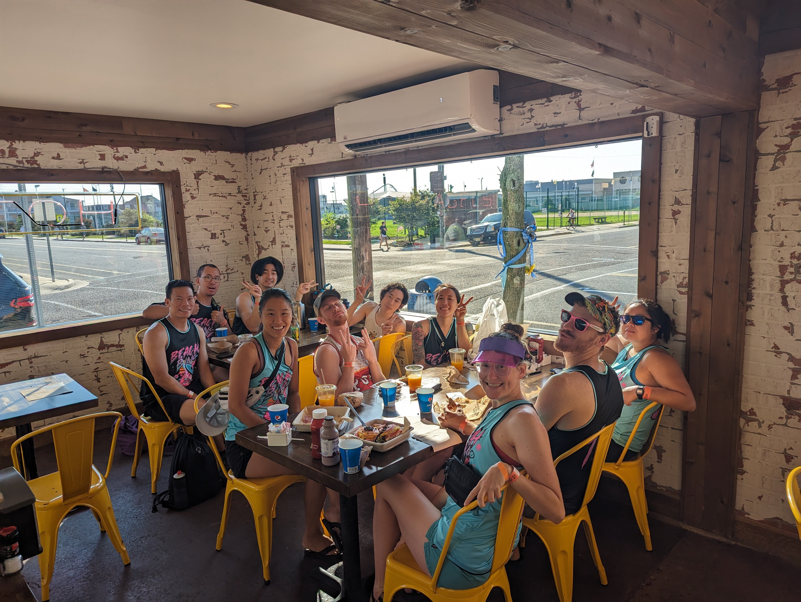
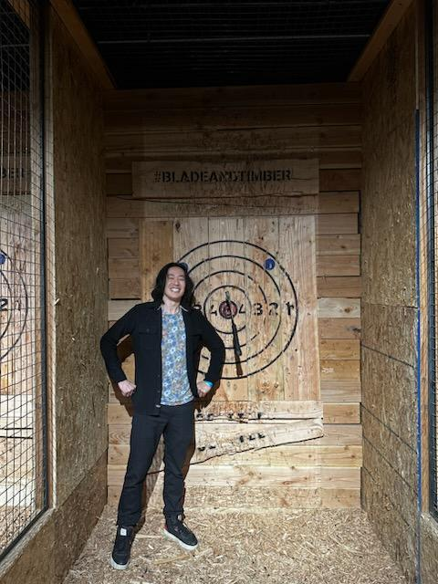

I really do not write in my blog enough. I go about setting this site to be some place I will write my thoughts, but I end up having to completely change up the hosting each year because things get deprecated throughout the year. Dougphung.com was unavailable for half the year because the hosting provider went out of business! 

## January
I started off the new year with a bang. Someone once told me that once an athelete hits their thirties, everyone experiences "The Injury" and its a big deciding factor whether or not they'll still be active. I managed to dislocate my shoulder pretty bad out in Solitude, Utah while snowboarding. I had a Hill-Sachs lesion and a labral tear from trying to do a jump I had done a couple times already. 

But once the shoulder was back in, we kept shredding! we got a crazy amount of snow, something like 48 inches over the week, and got snowed in. We had to build makeshift ramps from woodplanks and all took turns backing out the cars because it was a 2+ hr effort some days to get the cars out. We missed the heated driveway back in Colorado in 2022. 

When I got back to Austin, I started a healthcare meetup, moved to a new studio close to downtown Austin by the Crux Climbing gym, and experienced a crazy icestorm that took out most of Austin's power for 3 full days. I was lucky enough to have internet and power, but Sami was not. He had to sleep over a couple of the days. We were still figuring out how to navigate work, but eventually settled on alternating development days at each other's places. One of my cousins just had a newborn baby, Lennox,(I'm an uncle!) and they tried going to a hotel and there wasn't power there either! 

I also had to start training for a half marathon. So around this time I was trying to run a little bit, and managed to join Josh Cruz for a couple of his shorter sessions since he was training for the full marathon. I got one 10 mile session in and was completely drained. 

## February
Andrew Han and Mary were in town. I watched a super bowl over at Josh's while trying to figure out if Moyae was ever going to launch fully. Things were a little bit tough at this point. We had a pilot program the year prior, but it was the second month in the year, and we had no new information about what was going to happen. 

This will probably be my life's best poop story. 

The weekend of the 18th, Daniel and Emily flew in and I stupidly had a boozy milkshake at a boardgame cafe called "vigilante" the night prior. I'm lactose and alcohol intolerant. We were supposed to wake up at 4:30am to head over to the starting line, but at 3:30am my stomach was still growling and I was passing enough gas to solve all of Europe's pipeline disputes. I had no sleep and am a shy pooper. Because my studio had no bathroom fan and Daniel and Emily were staying over I thought I could use one of the bathrooms prior to the race. 

But once we parked and started warming up, none of the portable bathrooms were available, and I wasn't sure it would've been wise to "unplug" myself anyways. We started the race going really really slow. I think the first mile split was close to 12 minutes. Two miles in I was still cropdusting the whole race and was deathly afraid of letting out anything more than just gas because I was wearing white frisbee shorts. 

I didn't stop for any water breaks until the halfway point, and with each mile, I was getting more dehydrated and feeling a lot better! By the last mile, my split was in the low 7s. I finished and finally took a normal poo afterwards.

We gorged on BBQ afterwards and I packed up to go to San Francisco for John Huynh's wedding. 

In San Francisco I stayed at Daniel Won's place but he was out of town.  I rented a car and was given a free upgrade to a BMW because the battery needed running. Some friends were also in town for the wedding and I remember I had to bribe a bouncer $80 to get into a club because the venue was sold out and I didn't have tickets but some friends had a table. We celebrated John and Jina, had drinks at an Irish pub afterwards and visited Jina Bakes and the newlywed's home the following day. 

When I got back to Austin, my parents were in town to help my cousin adjust to the parenting lifestyle and the too got to see my modest 450 sqft studio. I got to spend some time with them even though I worked throughout most of their stay. 

The federal government finally awarded Moyae our CHPL number and we were an officially certified EHR for medicare reimbursements. 

## March

SXSW was going on in Austin, but Sami and I were still building the product after our certification. We visited downtown once.

One of my aunts were in town and I remember taking a bird scooter to a Chinese buffet, but everything this month was a total blur of work. 

Dgon Gonzales also visited Austin around this time and he introduced me some streamers and we got Korean BBQ at the new honey pig in Cedar Park. 

I started seeing someone for a little bit around this time, but I was working too much for it to work. However, she introduced me to IU... specifically the show My Mister... because she thought I might like it. It taught me a valuable lesson: Real relationships require real time and energy. 

Having celebrity crushes do not! So started my very healthy consumption of IU media and re-introduction to K-Pop. 

## April

I tried climbing more in April but my shoulder was still feeling bad. I managed to dislocate my shoulder again at the gym and Tim Reyes had to help me put it back in. 

Massen, Tim, Christine and I do an impromptu hike at McKinney Falls and I quickly learn that I do not like Texas nature. I thought there was a weird moss growing on some of the rocky caves, but they turned out to be hundreds of daddy long legged spiders clumped together. 

Around this time Sami and I were still working everyday until about 9pm - 10pm and we joked about World War 3 because tensions with China were rising and Japan announced they would build long range missles. 

## May

Tim and Christine introduce me to an awesome pasta place, Artipasta, and it becomes a good place to eat after climbing. We sometimes get Happy Lemon after. 

Alison Liu was in town. I managed to drink too much (3 drinks), got soaked, and had to take an uber home. I left my car downtown and had to get the car the following morning.

We learn that the doctors we were working with finally were going to be making a decision so we start preparing a lot of demos. 

By this point I've watched all of Hotel del Luna 2x over, My Mister 2x, and owned a single IU album. 
I don't have too many pictures from this month unfortunately. 

## June

A friend from LA moved to Austin and we hike Mt. Bonnell. There were power outages affecting Sami's place often so we were working more from my place. 

I stayed up 36 hours working on my 33rd birthday, the 2nd year in a row on my birthday where work likes to punish me. We had heard that launch day for Moyae would be on the 26th of June, so we were working 14-15hr days everyday. 

Crystal sent me IU's latest album and Daniel had sent me IU celebrity polaroids which I hung on my fridge.
This picture is actually from July when my cousin Stephen gave me the Vaporeon plushie, but all of these poloroids were from Daniel and they were my most valuable possession. I'd drive to the clinics in a daze listening to music I didn't understand trying to remember the features for the demo we had built the night before.

The first week of launch was chaos. Things were not smooth the first day and there were a couple of production issues in the morning. I honestly do not remember a lot the first couple of weeks after launch.

## July

The end of June and July were a blur. Sami and I were waking up at 6:50am to be in the offices by 7:30am or drive an hour to the other location in Taylor, TX and be there by 8:00am, taking notes, providing onsite support, and working until 2am to fix the problems we saw happen during the day. We were working 18-19hr days everyday making sure that every patient's visit was accounted for and that all the staff in the clinics could do their jobs well. 

I started ordering Factor meals in bulk and would get 18 meals delivered to my house each week. This was all I ate for a couple of months straight. 

We did that for 6 weeks and I managed to get away for a weekend to go to Wildwood. I had not done any physical activity for almost all of June and most of July since I dislocated my shoulder late April.

I had an early flight back to Austin, and Aimee and Duy had to take me home early as I barely made my flight back. I had booked flights at both IAD and BWI and ended up taking the Baltimore flight because it was more likely going to work out. I would've missed the Dulles flight. They honestly helped me so much when I was in a pinch this year. 

## August 

Around this time I started to get a lot of car trouble. Driving to Taylor one day, a rock hit Kendra's windshield (Kendra is my gay Subaru Forrester) and cracked a large portion of it. I paid $300 to get it replaced only to find out more bad news. 

Often, it was over 120°F in my car. And eventually Kendra started making noises. I kept putting it off because I had just changed the oil in my car earlier in the year and I did not drive that much. But a mechanic told me that I should sell her because he believed the engine was developing a "knock". 

Well literally the following day, a gasket blew up and I got stranded on the side of the highway. 

I paid $7500 for a new engine and had to use several different Priuses for 3 weeks. Here is Kendra getting towed. 

Sami and I had been applying to a couple different programs around this time because we had just launched officially and the application we had written was no longer trying to kill itself every time a new use case was attempted. At the end of August we were accepted into several different programs, but chose Techstars Seattle.

## September

From my monthly health meetings I was hosting at Capital Factory, someone told me a famous ophthalmologist, Dr. Ming Wang, was in town to debut the movie "Sight", but it was showing only at the local Chinese Church. It was a heartwrenching story (as is every story set around the cultural revolution) so I went and cried my eyes out at church and tried to talk to this doctor. He talked about finding faith and I found myself unsure if I should've been praying for more sleep or writing better code. 

Here I am listening to Dr. Ming Wang's testimony in Mandarin not understanding a word, but the movie had subtitles and was mostly in English.

Meanwhile Rebecca Tong made beautiful ski and snowboard invitations for our 2024 trip. 

## October

I flew into Seattle with Sami for a weekend to meet the Techstars program. Sami stayed for Mentor Madness which was an aptly named portion of the program. Sami had to do all of it. I joined in when I could, but over the course of about 3 weeks, we had over 200 different meetings on our calendars. I caught up with my cousin Victor the weekend I visited and he told he'd be in Austin the following week.

Weirdly, the room I booked was a marked for students, which I had no objection with. But the toilet was in the shower. 

So I managed to accomplish a feat I had never thought of trying that weekend too. 

I flew back to Austin and I immediately dislocated my shoulder again climbing with Victor at the same gym with the same staff working as before. The climbing gym kindly suggested that I do not return until I was better and suggested cancel my membership because I was a liability. 

I met my cousin Lennox for an extended period now that her immune system was more built up. She is now 10 months old and is beginning to stand on her own.

Billy Hayes and Addison Pock were in town and we did Rainey street and I attended a halloween pumpkin carving party with Peter Thiel adjacent friends. There, I met a Japanese arms dealer and asked if business was good after the Hamas attack on Isreal. 

## November
Sami and I met up in San Francisco to attend the American Academy of Ophthalmology conference of the world's ophthalmolgists and we switched places that weekend. After the conference I flew to Washington and rented a spot in Capitol Hill, Seattle. It was a lot of meetings, and at one point we had a production issue and I was not on site to fix it. We decided to hire for a QA testing position. 

I ate out for every meal eating at every asian spot I saw. I had been eating a lot of Factor meals back in Texas and appreciated the new selection. 

Techstars had a lot of happy hour events, but around Thanksgiving I flew home. I saw "Cool Crew" (Peter, Naomi, Justin, Dennis... a name given to us by a BGR employee back when they were still around in Clarendon in 2012) and adjacent friends. 

I played in a Fairfax Ultimate frisbee tournament. I tried to throw a hammer in the third game and managed to slip my arm out of its socket once again and this time it wouldn't go back in as easily. I got home at midnight and woke up at 4:00am to fly at 5:30am back to Seattle with my shoulder still hurting. 

We had axe throwing as a happy hour event a couple days later and I can happily say I managed to hit a bullseye left-handed. I was pretty sure my right arm would've just slipped right out again if i just held the axe with it.

Matt McMahon came to visit and we stayed inside most nights watching Castlevania and working. I'm sorry I'm such a buzzkill! The one day it did not rain, we went up to the space needle and then Henry Kissinger died.

## December
December 5th, Matt left early in the morning and Sami and I caught up for a day and switched places at the Airbnb. I flew back to Austin on the 5th on a redeye and was back in the clinics on the 6th. 

December 15th weekend I had Terry Black's bbq for the first time, my first touristy BBQ spot. IT WAS SO GOOD. If you visit me in Austin, this is where I'm taking you. I don't know why it took Lily and Massen to drag me here, but I got the beef rib and it was insanely good. I just didn't expect to spend $93 at 11:00am. 

Around this time I was mailing socks in the mail to random doctors that owned their own practices hoping they would be interested in switching their system over to us. We needed to prove that there were other practices that would switch over. 

I moved to Massen's house in Round Rock Christmas Eve and the movers I booked didn't show up. I had to ask my Mexican neighbors early in the morning via google translate if they could help me carry some boxes because my right arm was useless. 

I had Christmas dinner with my cousins Lena and Vijay and my niece Lennox. I hadn't had a home cooked meal since Thanksgiving and the food was delicious.

Massen and I started watching Singles Inferno and got I got hooked. I'd work 12-14 hours then eat late dinner and watch insanely attractive Koreans tried to find love.

We shot pool at a place near my old place I had just moved from and celebrated the new year at a new friend's house up in Round Rock. Here's Mike Pham tearing up the Simpsons Pinball machine at The Marquis, our new favorite billiards spot. 

I saw a commercial for the eye clinic we were working with while waiting for New Jeans to perform on TV. A single Smirnoff Ice 3 hours into the party, I concluded this still must be the my life's best timeline in the multiverse if our doctors had a commercial right before I celebrated the new year with Super Shy. 

Books I read in 2023: 

# Resolutions

This year I resolve to: 
- Get my shoulder fixed. Potentially involving surgery
- Cook more. I no longer live in the city and should theoretically be forced to cook more. 
- Read more. I

