2024 flew by so fast that I was still confusing events from 2023 when doing this recap. Sami and I still ended up working almost every single weekend this year, but we made it a point to work "from home" on Saturdays, but we'd still commute to each other's "offices" every other day. 

## January
The start of 2024 was absolutely hectic. We were still in the Seattle Techstars program. I was pretty bummed that I had to fly back to Austin and miss out on the cohort dinner at Bruce Lee's favorite restaurant, Tai Tung. I made a last minute decision to delay my snowboarding trip I had planned with the ski trip crew to join Sami on Demo Day in Seattle before flying out 18 hrs later to Colorado. One of our investors and doctors was going to be there, so it was important I be there too. 

Unfortunately, I didn't realize the demos were going to take so long and I had to leave right before Sami took the stage to make my flight. 

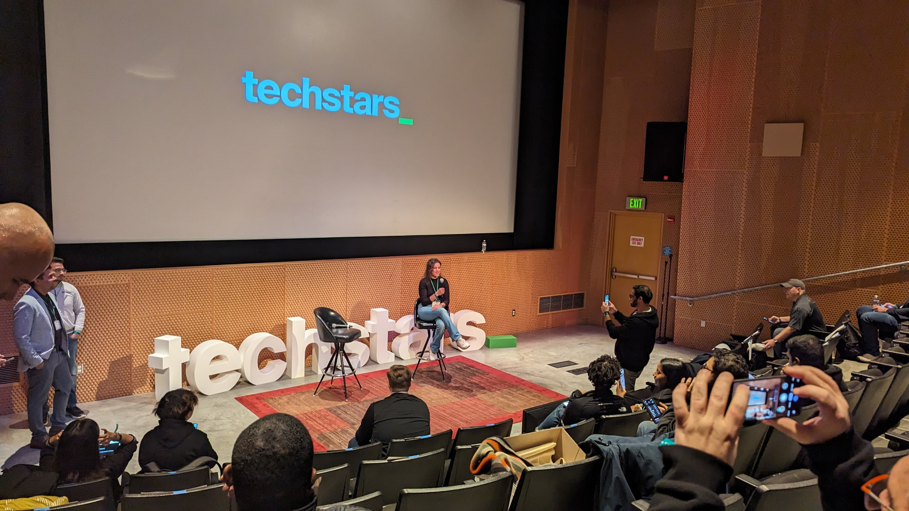

Winter park was magical and it was great to make new memories and catch up with the group. One of the most memorable things we ended up doing was playing, "Fishbowl" with the group, but Grady had suggested the final round be played as sharades with a blanket over the actor. This turned out to be more ridiculous and easier to guess than it sounds! 

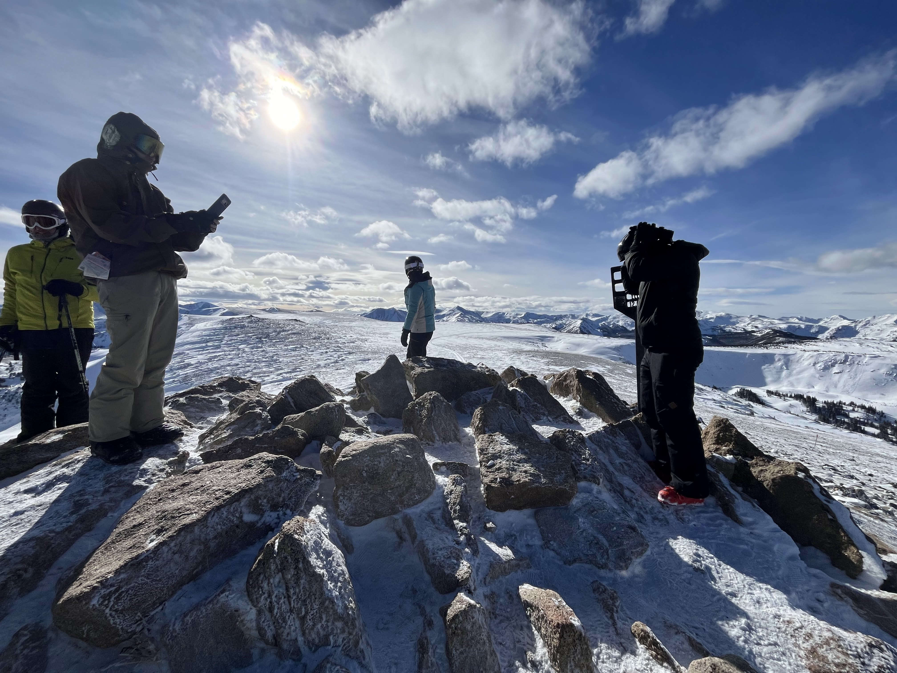

When I got back, I had a celebration for the first birthday of the healthcare group meetup I founded and they upgraded our meeting space to one of the biggest rooms at Capital Factory, because according to meetup.com we had 300 members. 

## February
I was pretty busy in February because Moyae was working on incorporating injections for retina ophthalmologists and I was trying to get a barcode scanner to read these drugs.

We were responding to a bunch of investor reach outs after demo day still. But then just weeks after demo day, we heard that the Techstars program itself was shutting down the Seattle program and they were firing everyone we had just spent 3 months with. This was a major setback.

February's routine consisted of a lot of work, and late-night TV. I think I watched all three seasons of Singles Inferno with Massen in February. It was heart-breaking seeing all these beautiful soon-to-be Korean celebrities find love on an island and I was approaching 34, haha. 

But I took a break one weekend to meet Massen's friends. They were Vietnamese dentists and all had young kids and it was the Super bowl and Lunar New Year. I spent an afternoon losing all my money to 3-4 year olds. The dentists had an endless supply of cash to give to the kids. At least Massen came out on top. 

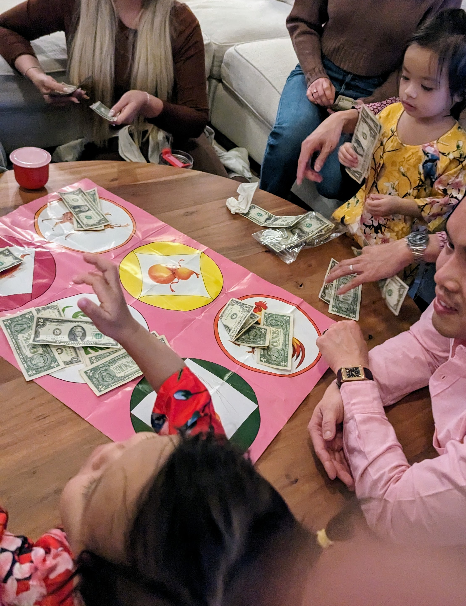
Never bet it all against children. They have 100+ beginner's luck. 

## March

Sami and I took the advice from one of our mentors and attended a smaller pitch competition. We were told this particular group in previous years hadn't seen too many successful startups, but once we got there, we quickly realized a lot of companies were not as small as we thought. Many were already making 10s of Millions in revenue and the grand prize was only 50K. We realized that the state of venture capital pre-seed must really suck. 

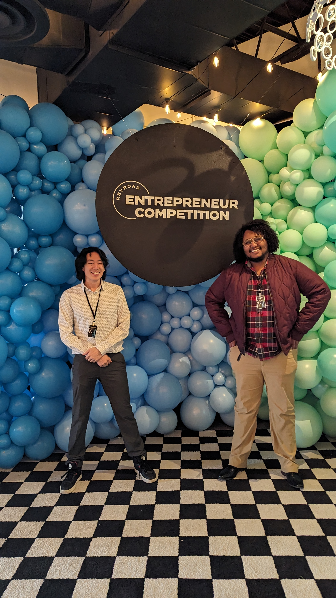

I got snowed in an extra night and got caught in a blizzard, and I stayed at the Evo hotel. This particular hotel had a rock climbing gym, a skate park, and snowboard rentals. I ended up buying a bunch of gently used gear, renting a snowboard and going up to Brighton for a couple hours to make the most of the snow and the delay. Grady happened to be in Salt Lake City too and was already on the slopes and I borrowed his jacket has he was leaving and I was heading up. At Brighton I asked to get my pass re-printed, but this proved to be a fatal mistake because I got my pass pulled. 

I met an architect from London doing some research on airport design in the hotel lobby and I delayed my flight another night to catch dinner.

Landing in Austin, there was SXSW Tech week going on and I was thrown into another hectic schedule where Moyae pitched several stages.

Sometime during this busy month Massen suggested I tried Talisman coffee and insisted we get Mums Foods BBQ, where I quickly learned that pastrami is best when smoked like barbeque and it might be my favorite spot in Austin. 

## April
At the top of April, Sami and I traveled out to ASCRS, our first smaller ophthalmology conference in Boston. We were excited to have a booth and even more excited that Mali one of our first engineering contractors joined us. 

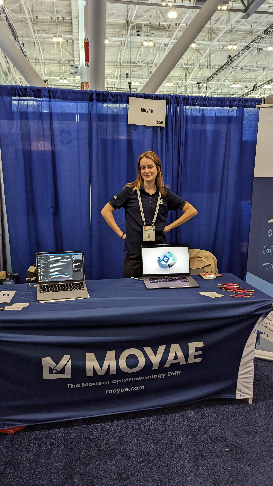
Mali manning the booth

We handed out Solar Eclipse glasses at the conference. Made some great connections and caught the eye of large practice management group who we'd later become partners with. Then I flew back to Austin just in time to join Peter, Arlene, and their daughter Phoebe at the park across the street 2 hours before the solar eclipse hit Austin in a field of blooming bluebells. 

Sometime this month, I bought a flipper device and Sami programmed it so that I could get into his apartment building downtown and made a bunch of other key fobs. Between late deployments we talked a lot of about the rise of pirates in the red sea, the port Ethiopia was getting from Somaliland, and what the legacy of Biden's CHIP Act would mean if TSMC finished its plants in Arizona. GE split into 3 different stocks and I was very lucky that my boomer stock play worked. It felt like Bitcoin Cash fork in 2017. 

## May

In May, my sister was graduating from here physical therapy program so I had a disastrous flight from Austin to Richmond. There was a connection in Charlotte, but the entire airport had cancelled flights. I ended up riding with some pilots to a remote location in order to call an uber because there were thousands of people stranded. I then booked a midnight greyhound into Richmond because American Airlines couldn't place me on a flight that would make the graduation the next morning. 

The bus smelled like piss and took 6 hours. But I made the graduation ceremony.

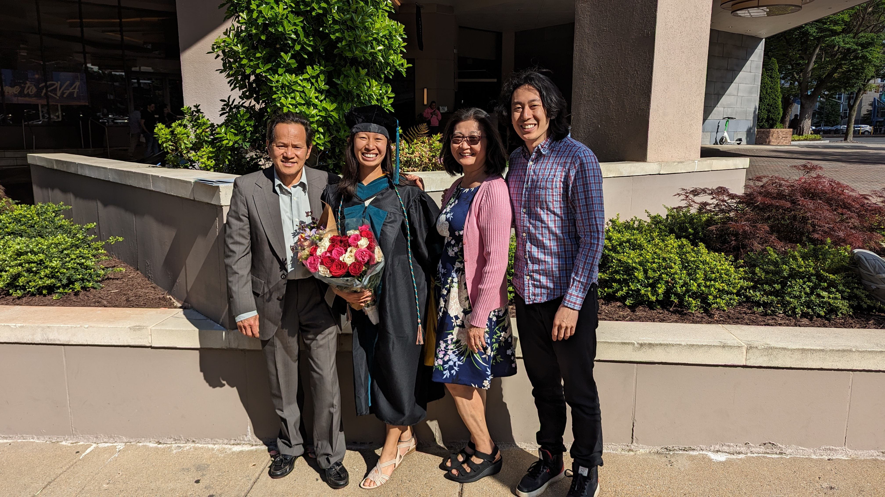

Kristin picked me up from the bus station and we got an early breakfast. We ended up going climbing but my shoulder wouldn't let me do much and I was pretty out of shape. It felt embarassing climbing in front of her sister who was a phenom.

I spent the nights in Richmond at Kristin's and she told me her neighboring house was probably going to go up for sale soon. 

The following week I flew back into Austin and Sami and I had heard about an accelerator group called the wildcatters in Dallas so we attended a big talk they had put together and did some networking. Also, there was a tornado on the way back which destroyed a headquarters of some people in industry but we didn't know until many months later. 

## June

In June, my wallet was stolen at a gas station in front of me. There was security camera footage but the cops said the perp lived counties away so they couldn't do anything.

I felt really out of shape so I started running again. I opened up the dating apps again and matched with someone I thought was a missed connection from 2 years prior. My Subaru Forrester, Kendra, died. I bought a used Outback.

There was a shooting across the street in the suburbs for a juneteenth celebration. 

I made a reservation for two at Barley Swine for my birthday, but the food was extremely salty and was actually the first time I ever had to send food back. It was a bit embarassing in front of a date being a snob. 

Massen and I discovered the latest store in Round Rock that stays open is the Burlington Coat factory and I learn that it is not fancy... for some reason my whole life I thought this store was like Nordstrom, only to find out it is more like a TJ Maxx. 

Sami and I learned that the Entermedicare program was being shut down at the end of July. We were officially being let go. That meant if I wanted healh insurance to cover anything I better do it soon. 

I used Suno AI and published a song on Spotify and Youtube called Corner of Sepulveda. It took about 10 days between submitting before it was listed.

## July

I went through surgery for my right shoulder. About 36 hours after surgery I caught up with some cousins. Got a Boeing shirt from an uncle and then promptly headed to a midnight showing of a 4D Imax Deadpool vs Wolverine that proceeded to poke me in my shoulder everytime Deadpool killed someone in the movie. 

It was the most painful movie I'd ever experienced.

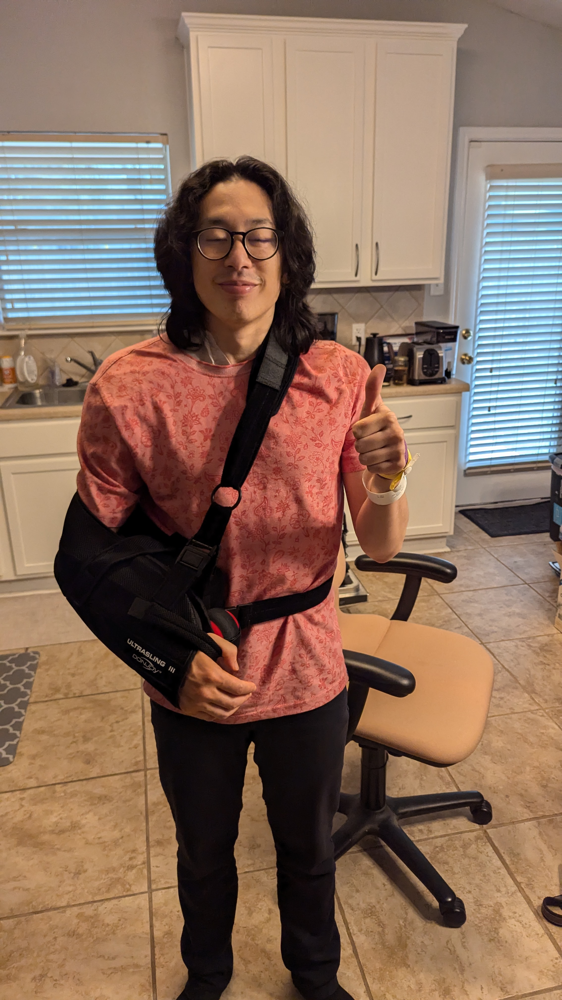

Around this time we went live with Moyae's integration of our practice management platform. This was a big move because the incumbent system didn't interface well with anything. Now with a different system, we could finally have a holistic experience between the front desk and our EMR software for the techs and doctors to use. 

Biden dropped out of the presidential race, and I started to realize how very wrong my predictions for 2024 would turn out was going to be. Sami started talking about contingencies.

I made a consulting company, "pudge labs" in case the parent company from my original day job needed some additional work done after they'd just let me go. 

## August 

A couple of friends and I had been buying property in Richmond, VA. We closed on our 2nd home, but it needed a lot of work. We installed a new roof and Kristin helped us get the home ready for leasing.  

Back in Austin, I was getting boba in the evening with some friends, and they told me that shopping plaza we were in was a nesting spot for some migratory birds. That day just so happened to be the day they were stopping by Austin. We stepped outside into a massive bird tornado and got shat on.

I got a message from a stranger saying they "found" my wallet in a dumpster with everything inside. They asked for a reward to send it back. I'd already replaced everything, except for one of the Polaroids of IU that Daniel had sent me for my birthday in 2023. The stranger asked for a reward of $50 to return the wallet with the picture of my "girlfriend". I was very happy to pay. This person clearly thought Lee Jieun was my girlfriend and that was the true con. 

I had pretty vivid dream that a friend's sister wasn't doing well, so I booked tickets out to Sarasota at the end of August. 

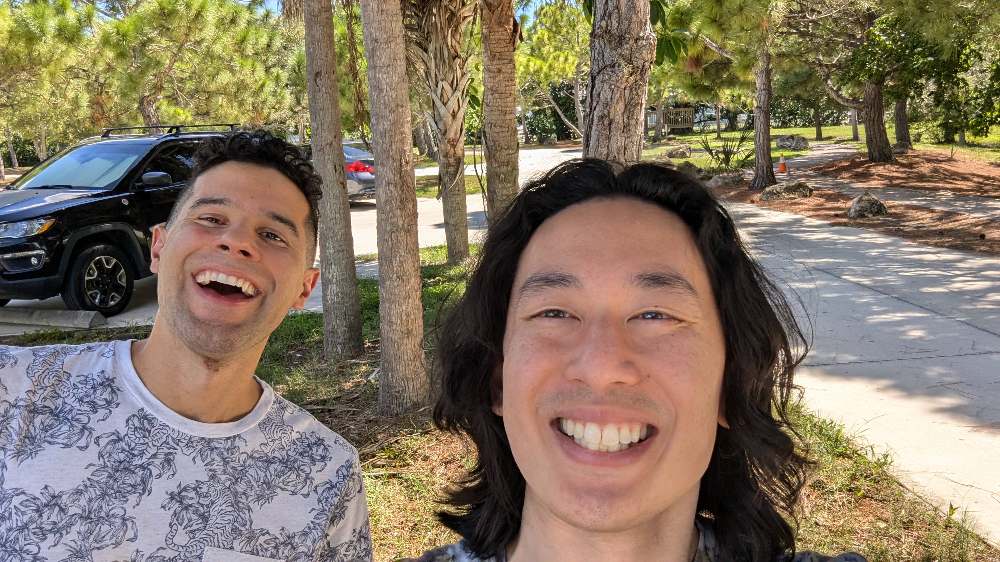

## September

September was a lot of work. I stopped going to PT because my health insurance ran out. 

Trump survived another attempt on his life, and the conspiracy side of me is convinced that the whatever ties the FBI and CIA have to radicalized groups and crime families group are now so diminished they can't pull a JFK or MLK. I find myself going between Joe Rogan podcasts, Kaisa's IG reels, and Hasan Piker's twitch streams.

But I found time to see Glass Animals. I learned that there were two different stages that were named "Moody". I queued in the wrong line for Glass Animals and was only told by the security guard scanning my ticket. 
It should've been obvious when I saw the that the merch shop was selling #brat shirts. 

The following week Sheng Wang proceeded to deliver the best comedy set I'd ever attended. He was also super nice and met his fans by the merch booth. I immediately called my parents and told them they HAD to see his special on Netflix.

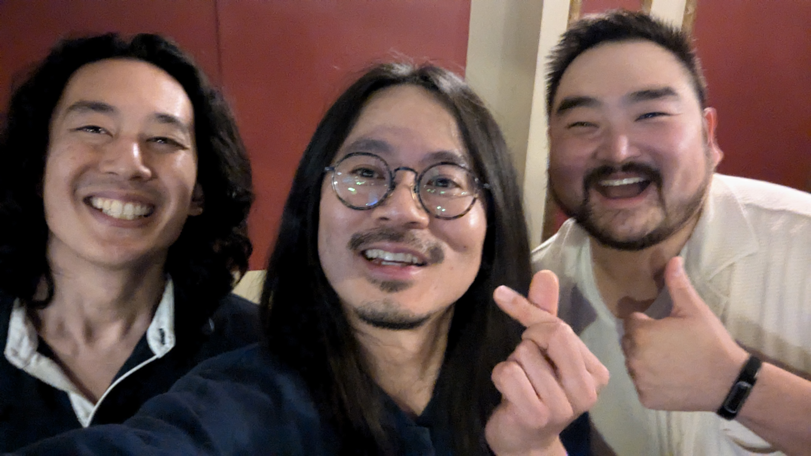

## October

I flew into LA to attend a friend / mentor's wedding and got to briefly see some LA friends. We listened to motown and got breakfast at Destroyer. My rental car got a flat tire and I had to wait for AAA to replace the tire so I could get a replacement car. They sent me to the Beverly Hills Enterprise rental, and the only equivalent car they had was a Dodge Challenger. I spent some hours driving on the 5 listening to podcasts of North Korean boys being sent into Ukraine and being blown up as they trained.

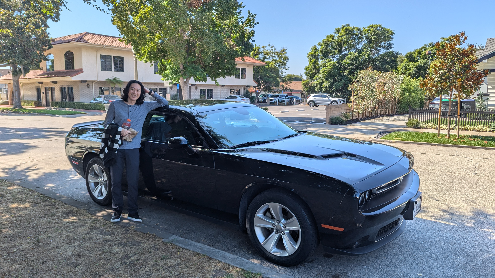

I drove into Socal and stayed on Joy's couch. We had Ramen and talked more about snowboarding and her upcoming trip to Yosemite. 

Pudge labs landed a contract with the old day job. 

## November

Moyae brought on an experienced Revenue Growth manager who had many years in the healthcare sales sector. At the same time we were busy becoming the next EMR to comply with the Academy of Ophthalmology's standards on Merit-Based Incentive Payment Systems and there was a company that we were workign with to have a seamless connection. 

Sami was interested in an EV showcase and I didn't have anything planned one Sunday morning, so we went to a quick convention. I rode a bluetooth two wheeled skateboard and had a professional driver drift me around a dirt course in a Ford Mach-E. 

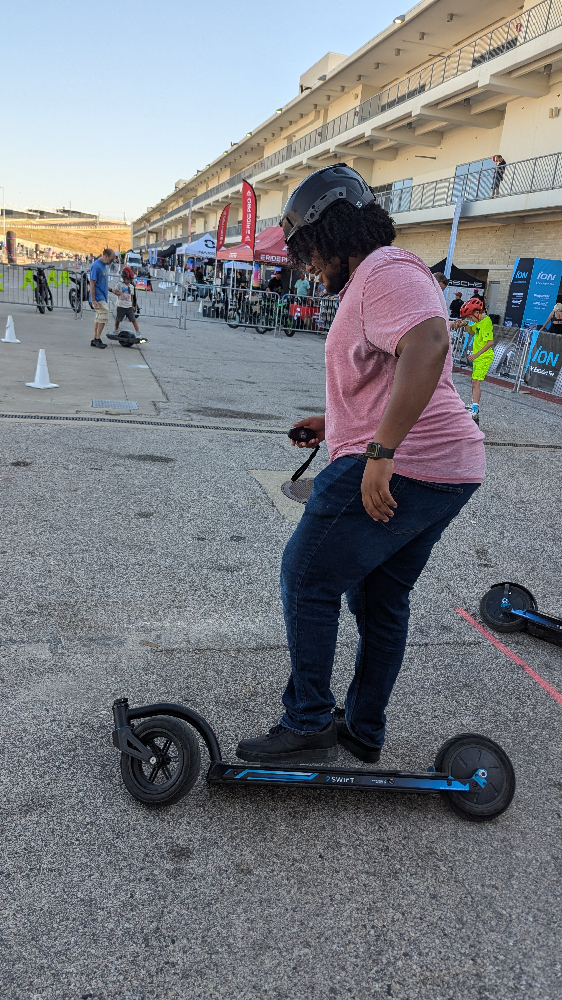

Before Thanksiving, I connected with someone at a party over Arcane Season 2, and we watched the first couple episodes at a hotel downtown. The animation style is really beautiful and I wished I had studied French harder in HS because the interviews with the designers were in french. 

On Thanksgiving weekend the latest Richmond house was leased.

## December

Luigi shot a healthcare CEO. 

I found some time to visit home, but I had to be back for Christmas and New years in Austin because the clinic was closed. I tried to see as many friends as I could. Justin and James brought me back out to Clarendon Ballroom because his friends were dj'ing. I thought I would never step foot that establishment again after 2013. It felt so nostalgic to be in Clarendon then drive out to Annandale in search of 3:30am late-night comfort Korean food. I really do hope that if someone had to do a historic review on Nova culture they do not miss on this, because this is a staple. Even LA Ktown doesn't even stay up as late as Annandale. 

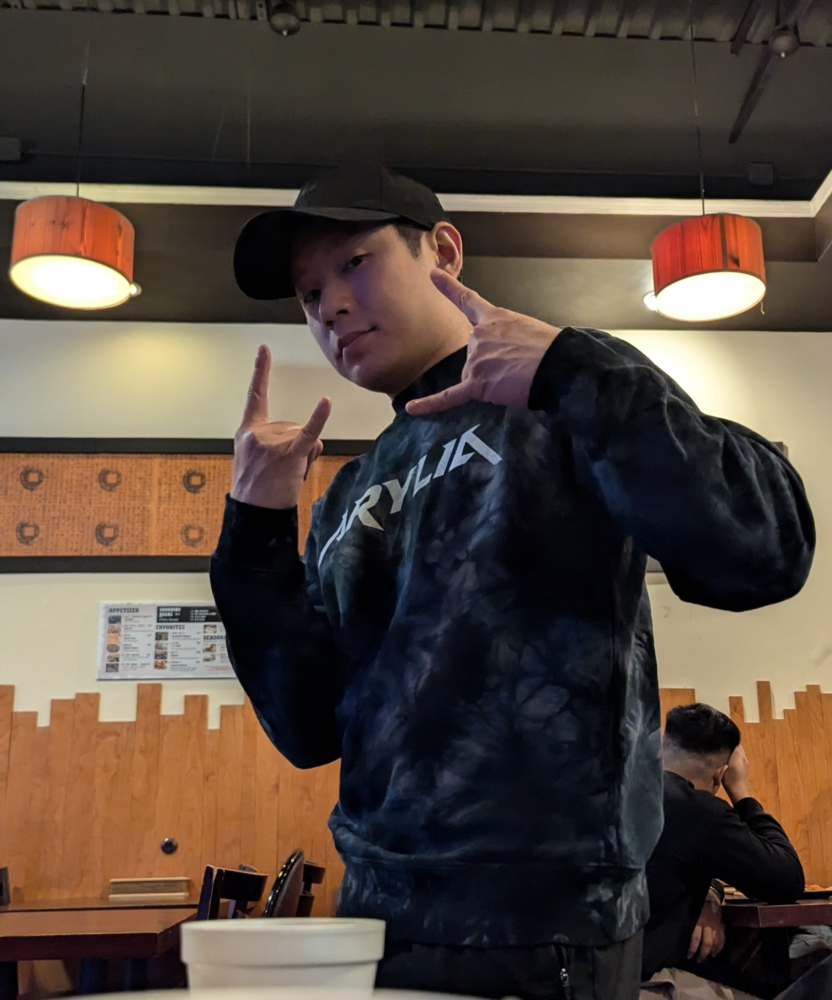

I got an email concerning the monthly health meetup group I hosted that I was being given free office space in Downtown Austin at Capital Factory. The group grew to 450 members.

Sami is reading Noam Chomsky's "Who Rules the World" and I start see the book everywhere I go. 

# 2024 predictions and goals recap and upcoming 2025 ones
I predicted a lot of things wrong for 2024, which made this writeup harder to write. Some years I got almost everything right, but I was wrong about Biden winning in a landslide. I was wrong about a cease-fire in Gaza. I was wrong about peace in Ukraine. I was wrong about conflict surrounding El Salvador. I was wrong about tensions rising between India and China (they actually reached a resolution there). I was wrong about the hype surrounding AGI in that I believed fringe cults would emerge touting their sentience. 

I didn't get anything right! But after Biden dropped out in July, I re-corrected course and was right that Bitcoin would surge and acted accordingly. 

For resolutions I did get surgery done, I did learn a new song on Piano (Summer by Joe Hisashi), and I did write some handwritten letters to friends.

Even though I'm cheating because this post is being published at the end of January, it's just in time for Lunar New Years. 

This year I predict: 

- Trump will solidify plans for a third term. 
- Trump will remove the age limit for presidency
- Trump will set the stage for Barron Trump to take a strong executive role like VP
- A new class war between "Old Money" and "New Money" in America as cryptos print millionaires and billionaires overnight. This has existed but a true organized label for this hasn't been in the limelight.
- A complete colonization of Gaza as Isreal declares a second "state" under its control. 
- I predict the first mass reported friendly fire accidental losses suffered on the battlefield as a result of usage of weaponized AI. 
- Talks about California seceding from the US
- AOC may talk about running for presidency in 2028. 
- Russia will stockpile Ethereum in response to US stockpiling Bitcoin. 
- We will learn from the papers being released about JFK assassination, MLK, etc, that the hands of government were involved, and Trump will use that to further weaken the current government to install his own militia. Hope it stems from SpaceForce so that there is some sick humor in this as they work to deal with "aliens". 
- This may last longer than 2025, but I predict that as Korean media continues to grow at an incredible pace, that kpop and kdramas will win the culture war and for the first time ever, there will be more japanese, chinese, and vietnamese people studying the language on duolingo. In the past, this language was Mandarin.

# Resolutions

This year I resolve to: 
- Take some dance lessons. I'd like to learn to shuffle and I'm so out of shape. It's a shame, turning 35 and wanting to learn this now. It would've been useful when I still went to festivals and raves! 
- find time to read the Red Rising series. So many people from different political backgrounds have recommended it. 
- Learn one more song on the piano. When i say "learn" i mean be able to play it at tempo with Sheet Music. I cannot remember more than 4 notes from memory. I fear dementia will hit me very early. 
- Get back into ultimate frisbee again
- Help the transition of Fairfax Ultimate handover to Alexis Planche

Closing notes: 

I found myself also on my phone a lot in 2024. I used to never have a doomscrolling problem, but I found myself doing that a lot as I got too tired sometimes to even start a show on Netflix or play video games after coding. I'd sit at my desk and scroll for an hour around 8pm unless someone pinged me. That's bad, but there were some amazing musicians / artists I found through this. Some notable ones: 

The Forest Jar - check this channel out on youtube or IG. Different philosophical takes by different cryptids and fictional characters / monsters. 
https://www.youtube.com/channel/UCiv0JCm42weeVYjRfccHZ2A

Jesse Welles - The current great Bob Dylan of the decade. He writes and performs protest songs that remind me of Bob Dylan's Hurricane. https://www.youtube.com/shorts/CiTS3xpL4WY

Aimee Carty - The girl who had the viral song "2 days into college", but I really enjoyed her other songs too. Her work reminds me of an early Bo Burnham, without all the wisecracks, but a bit more wistful and nostalgic. https://www.youtube.com/channel/UCZ1PFiDPTCGfmvd87gd8Fbg

