I'm beginning to think time itself has momentum. People used to say chase your dreams, but I don't hear that much anymore now that I'm a guy of a certain age. Maybe the momentum emerges when there are fewer breaks of celebration in-between. 2025 was busy, but there was a lot of Magic the Gathering and friends in-between.

##  January 

While Trump was inaugurated as president in DC, the annual ski trip was hppening in Colorado. We had a big group this year and I loosely organized the beer olympics to a Squid Games Season 2 theme. 

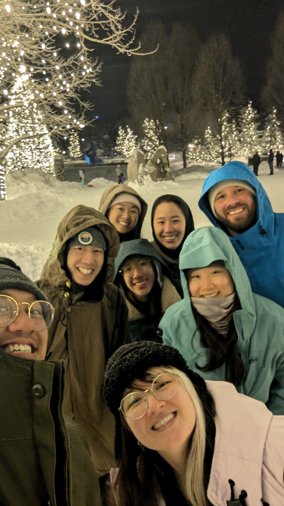
*I think we were missing another car that was whisky tasting*

The snow was good, but I think the most memorable part of the trip was actually driving a Wagoneer packed with 9 people on a powder day to a trading card shop and buying out their entire inventory of booster boxes and spending the day playing MTG.

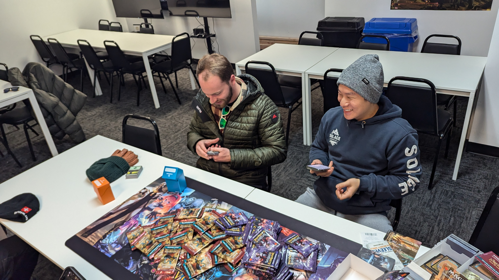
*Grady and james cracking lord of the rings set on a pow day*

We played MTG everywhere. 
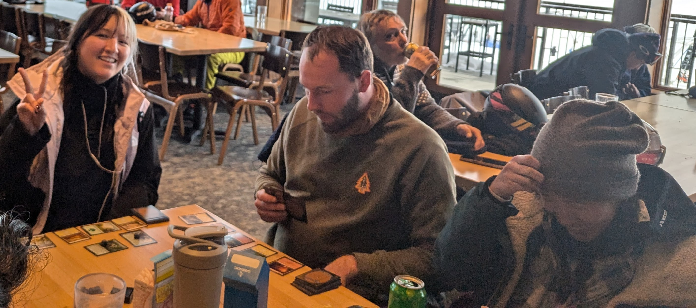
*Crystal is probably regretting she didnt bring her deck*

## February
I had dinner with some friends I had made from my healthcare meetup group at DAMA and they told me they were probably going to move soon. I was a bit bummed about this because they were the only friends I'd made outside of friends of friends in Austin.

I was still hosting those healthcare meetups at Capital Factory and I think on meetup.com we had 700 members around then.

Near the end of February, Trump told Zelenskyy, "You don't have the cards. With us, you have the cards, but without us, you don't have any cards." If only Zelenskyy was drafting MTG with us, he'd have so many cards. ([PBS NewsHour](https://www.pbs.org/newshour/politics/what-trump-and-zelenskyy-said-during-their-heated-argument-in-the-oval-office))

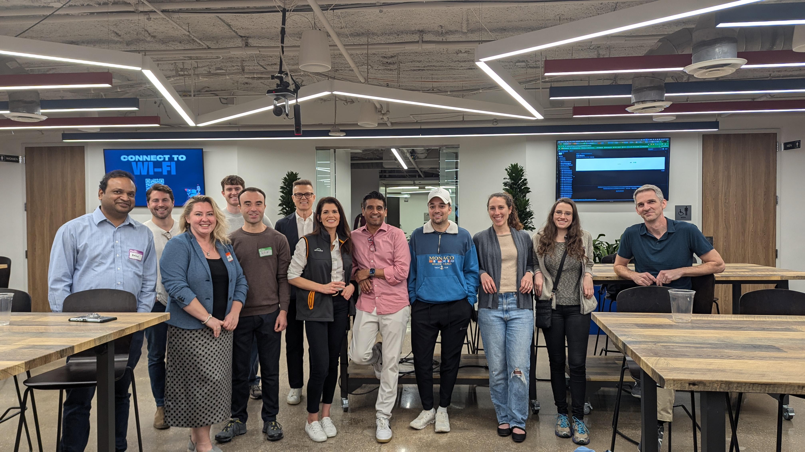
*This was taken at the end when I was kicking people out*

I was also following Michael Reeves and Ludwig travel tip-to-tip from the southern tip of Japan to the Northern tip without using Highways, GPS, and their limited Japanese skills. It looked like a lot of fun and I thought about getting a bike. 

## March
I visited my cousin Steven's place got to see what what Alena was working on for Austin's 48 hr film festival. 

Some friends were eating sushi at Kura and I joined late and we made our way to UFO Arcade. 

Back in January, my dad had sent via US Postal Service some Banh Chung (Sticky rice with pork filling). He froze it but I had refrained from eating it because of the snowboarding trip and there were some social settings coming up that I didn't want to risk food poisoning for. I had a stretch of days of heads down coding so I went to Hmart looking for some chinese pickled cucumbers to eat the mailed gift. 

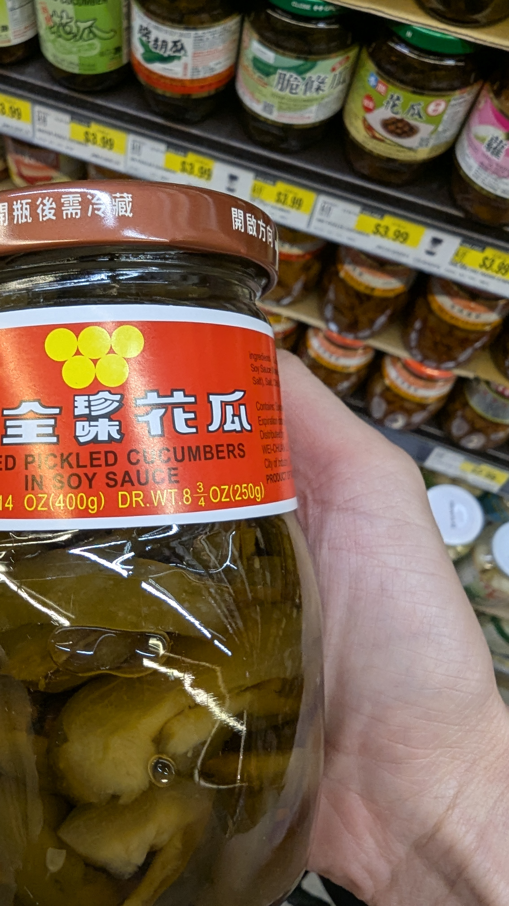
*This is the stuff you want for your Banh Chung*

I reached Legend rank in Dota and huge earthquake ripped through Myanmar, but the military used the earthquake to their advantage and used it to surprise attack dissenting villages / rebels. 

## April
Our friends had a going away party and I know I should've been expecting young social people, but I definitely felt like the uncle in the room. Their drinking games included a lot more running than I was used to! And when they said that was the pre-game and they were going to the bar I was exhausted! 

I had monthly meetings with AWS and they invited me to join an AI training session that lasted a full day on site. The event was so crowded, there were two additional overflow rooms. This should've been the sign to invest more heavily in AI companies.

JD Vance last hit the Pope. 

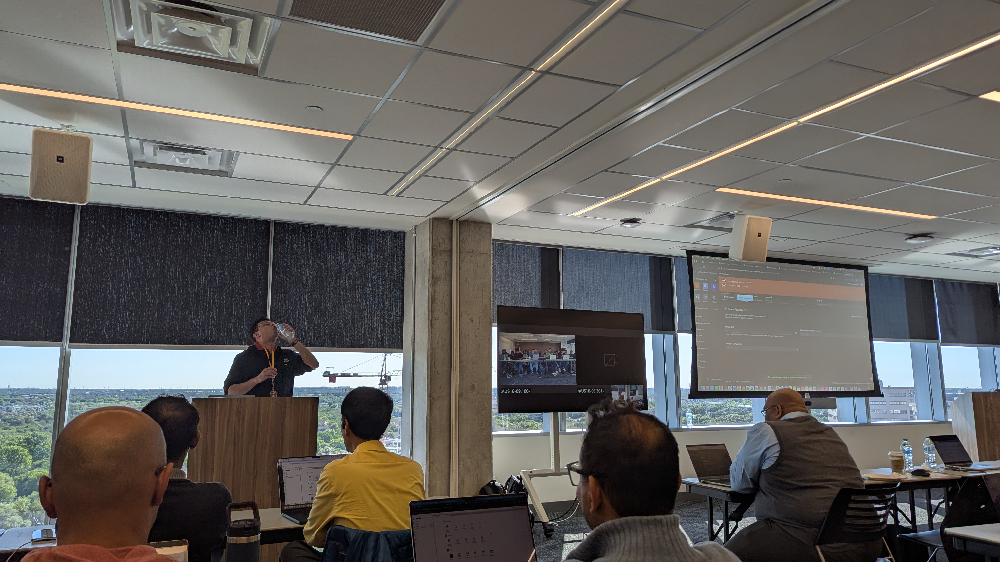
*I was actually super tired and fell asleep in the afternoon during one of the lectures*

Then I flew out to LA for the annual American Society of Cataract and Refractive Surgery (ASCRS). I recommend getting good shoes and good carpetting because standing on convention floors for 8+ hours every day is hard on the feet! The chairs and desk and cubbies I bought from Habitat for Humanity. I got my first taste of dealing with unions and their foremen trying to negotiate for a dolley. Bart knew about an afterparty and got us an invite in. 

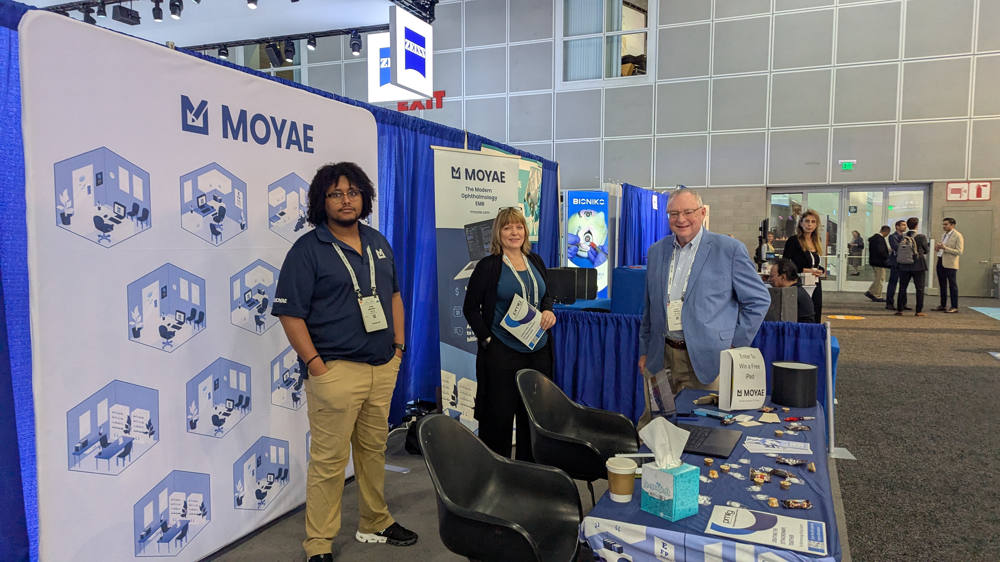
*This was on the second day after we asked to be moved closer to the entrance*

## May
I think we were mostly heads down developing new features for Moyae this month. We were following up on leads from the conference.  I hardly have any pictures or travel other than to Sami's to work. It rained so much in May and there were some crazy winds that ripped the shingles off of Massen's roof. I was crawling into attics inspecting for leaks at Massens but the only blurry photo from this month was of how flooded the streets were and a possum I found walking. 

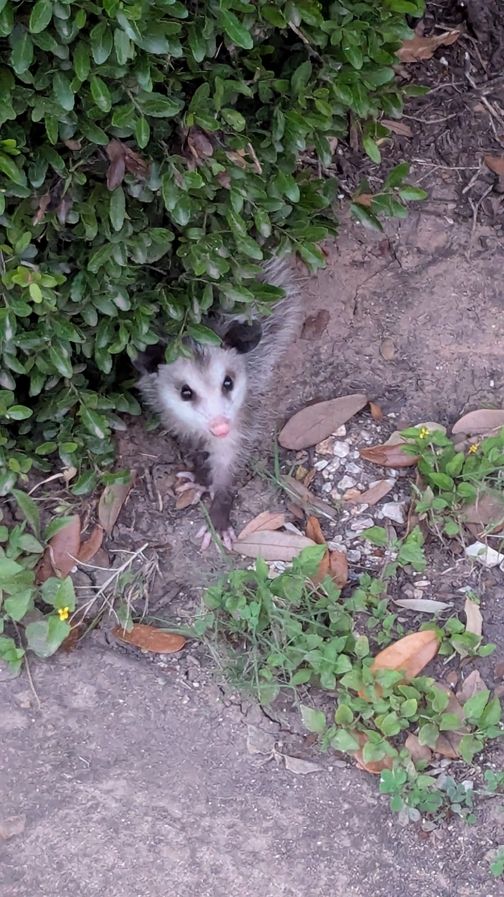
*This lil guy was a bit further out but backed up pretty far when i got my camera out*

Some more power is solidified in America as we get a new North American pope and Maduro down in Venezuela held a rigged election. 

I remember eating at Gyu-kaku with some friends... and Sami had moved to closer to Mueller area on MLK. 

## June
Josh started hosting poker nights at his new house. 

I turned 35. Sami gifted me a Final Fantasy MTG pre-release box for my birthday outside of Umi AYCE. My mom sent a birthday care package and it had a set of pens with my name engraved. I started taking my MSF courses for my motorcyle license.

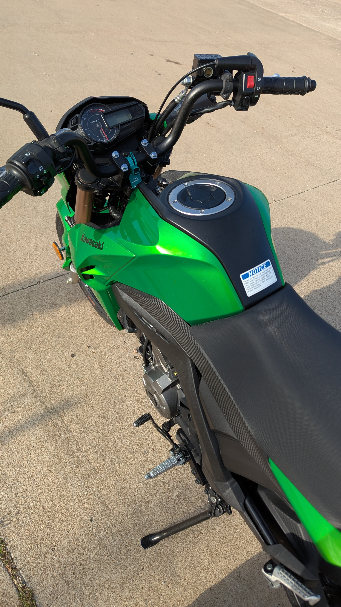
*Look at this cute lil Kawasaki Z125. Its street legal.*

I also attended Health Supernova hosted by Capital Factory and met some interesting people. A doctor recommended Moyae be used as a modular EMR for combat. 

Israel launched missile strikes against Iran's nuclear and military infrastructures. And a plane crashed in India crashed with just 1 survivor like the M. Night Shyamalan Unbreakable. 

But anime movies were big in 2025 and I saw the DanDaDan movie in theaters with Massen. 

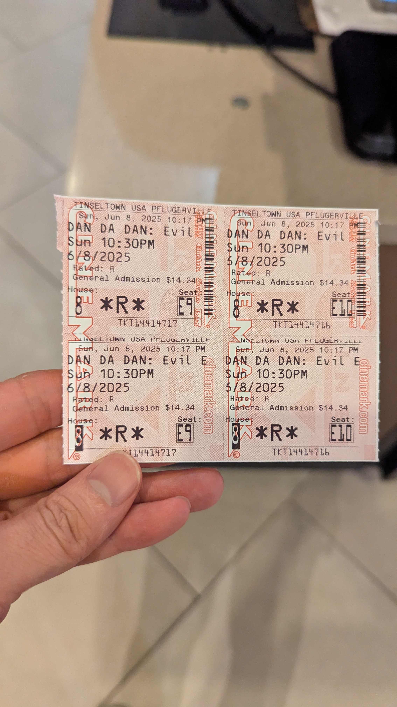
*Massen was running late and I bought a large tub of popcorn with no refills, thinking anyone who would need a refill was crazy. Then i dropped my tub of popcorn because i was trying to hold two icees and the tub and immediately regretted not buying the extra large with free refills.*

I don't really remember being in the theater watching it. I think I fell asleep.

## July
Sami really wanted to shoot fireworks, but I never got around to buying any. We celebrated the 4th at Sami's place and grilled way more food than 3 guys could eat. 

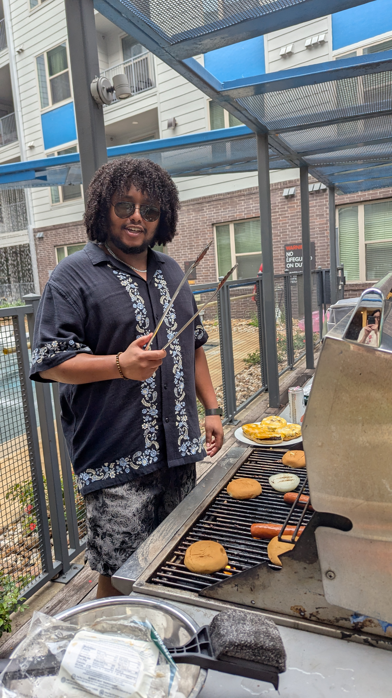
*We had 24 hotdogs, 8 burgers, 2 beef HEB Fajitas packages for tacos, and a ton of other chips and guac. We should've invited more friends.*

The Final Fantasy MTG set was still really popular and I tried to bribe the card shop owner $20 bucks to let us buy enough packs to do a sealed (6 packs each) format since you can't really draft with 2 people and they still said no. 

James had the "Last Wildwood" event and I think it was planned better than some weddings. He had pizza boxes made with matching safari uniforms for everyone. Inside he had a yearbook with photos from every wildwood for the past 12 years and an empty poloraid spot for the current years, and while we were out playing, he developed this year's photo for us to slide into place. 

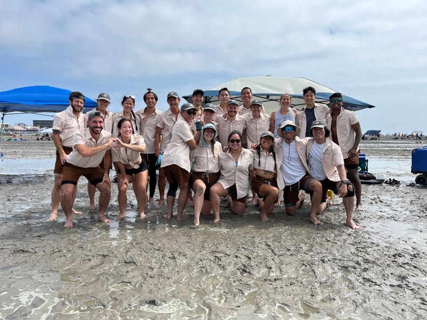
*This is the picture in the yearbook*

It made me really miss frisbee, but it warmed my heart seeing the new generation of club frisbee revive the Lord team I named. It was a good thing James invited so many of the good players onto the team because I was out of breathe after the first point. I did get the best layout catch I've had in years, but to this day, I don't think I have a true layout picture for all my years of sacrifice, haha.

I don't remember any world politics really for July. It was too busy. Here's some more Wildwood. 

<video controls width="100%">
  <source src="/wildwoodplay.mp4" type="video/mp4">
  Your browser does not support the video tag.
</video>

*Jacob marked by Pineapple Pizza swings to Kristin. Kristin backhands to Crystal, and Adel recieves in the end zone for a point.*

## August
I came back from Wildwood and immediately packed to onboard a new practices out in Arizona. I got to hangout with an old friend in Phoenix, lose a bunch of games of Dota in a gaming cafe, and teach a lot of people how to use Moyae. 
While i was out in Sedona, I was trapped in a hotel fornearly 2 weeks. I wasn't finished working until around 10pm each night, so I ended up gyming everyday and I was probably at my strongest point here since surgery last year. I had been running 2 miles a couple times a week leading into Wildwood and now the strength training made me feel great.

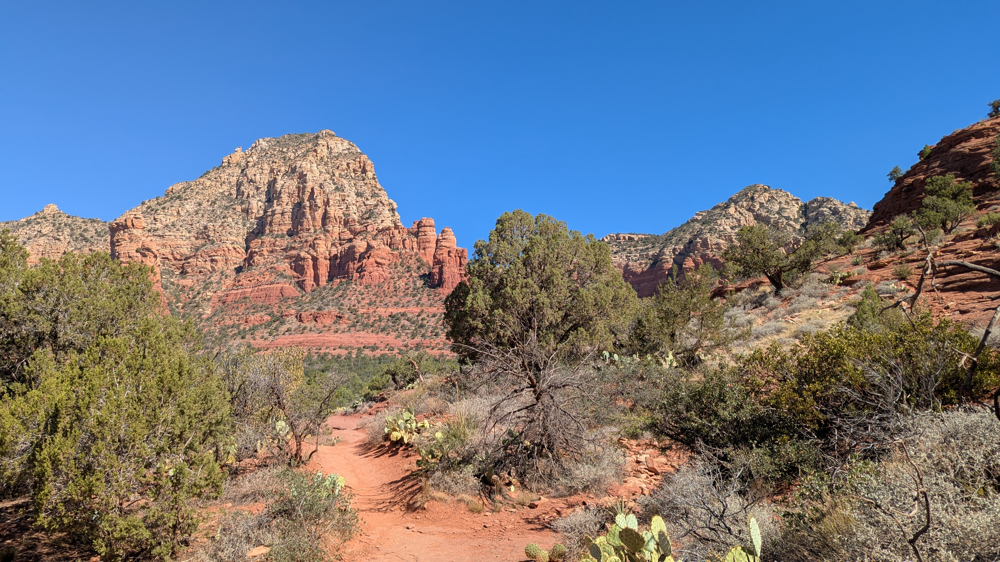
*Heres some red rocks*

Then I flew back to the east coast and joined my dad's side of the family for a "crabbing trip" but I was working the entire time. I didn't get to be out during daylight at all except for a Saturday morning.

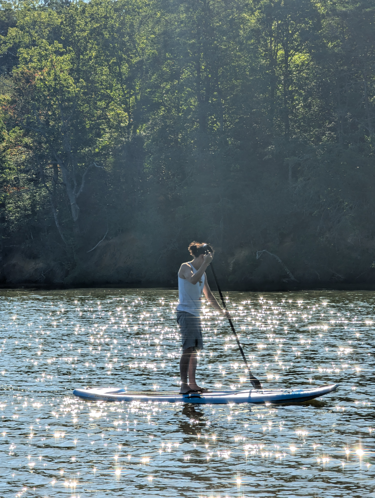
*Paddleboarding looks cooler than it actually is*

Jpow lowered the interest rates for the first time and everything soared around this time. I was feeling pretty good about my stock picks. 

## September
Checked out smokey buns bbq. The owner thought I was a food reviewer because I kept asking questions. 

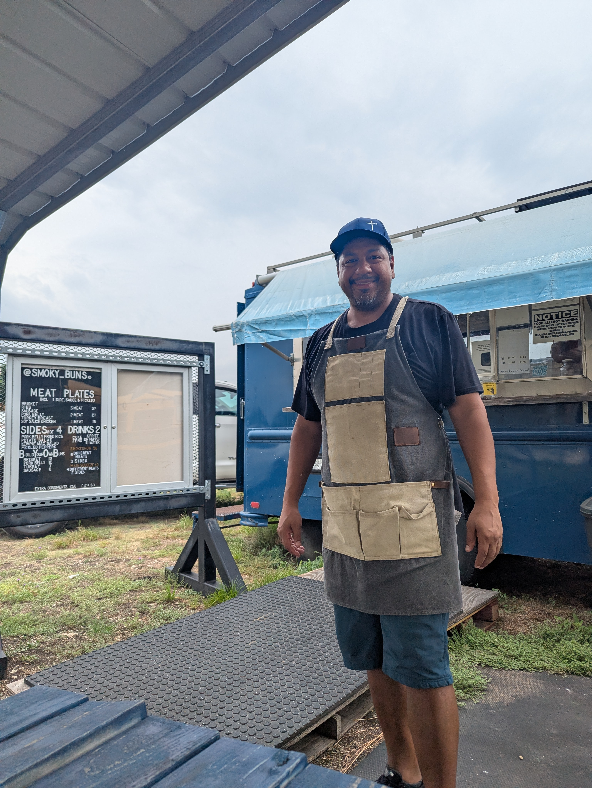
*Here is pitmaster Jesse. Some of the BBQ is asian inspired,his wife is Filipino*

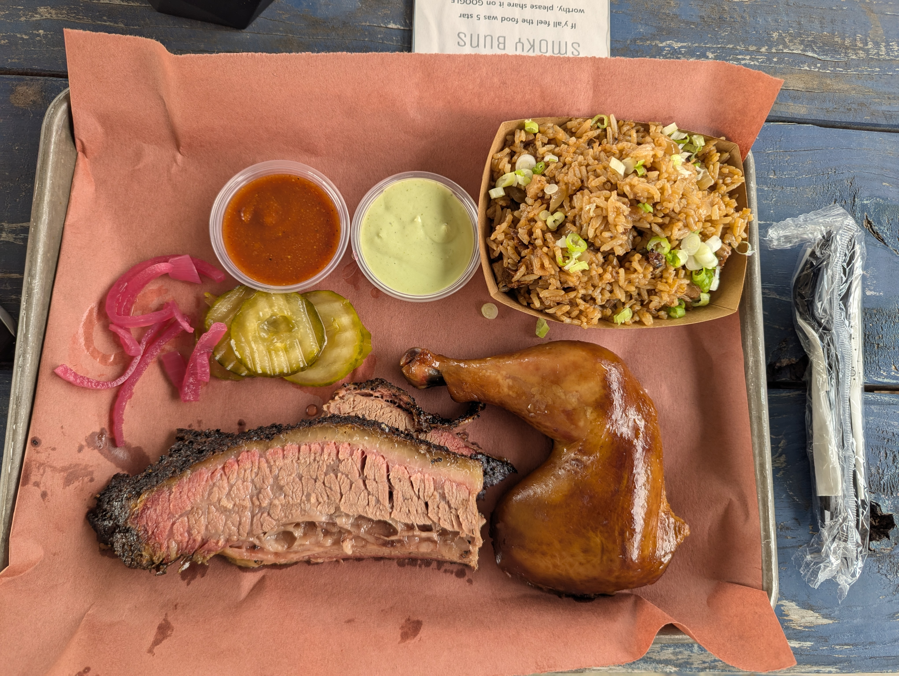
*Here is the food. Chicken has an Adobo glaze*

I had stopped doing any physical activity while I locked in some more because Sami was out in California onboarding a different practice. 

I'm told I'm trash at Dota2 on Discord and change my gaming name to "Boomer Fingers" to set realistic expectations. Nepal's gen Z votes in a new prime minister via Discord and Charlie Kirk gets Luigi'd. 

## October
I give up on Dota because I am on a hot losing streak. I pick up Stardew Valley instead. Remember folks, you don't have to get better, you can just avoid society. Why improve when theres nobody to please?

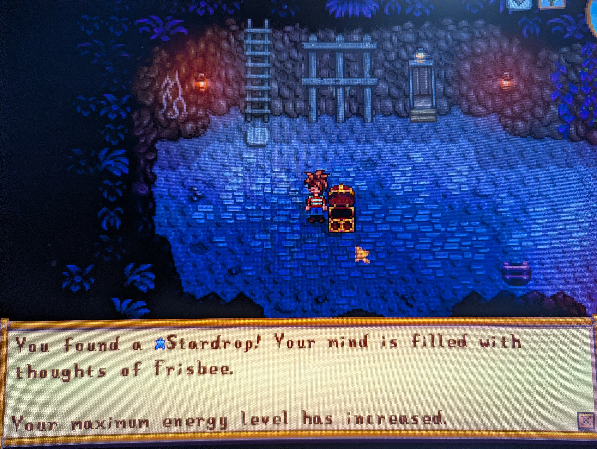
*I was playing from an old saved file from 2018 and I forgot that I had put Frisbee was what made my farmer happy. So when I got my next Stardrop, it was a nice surprise. Fun Fact, Stardew Valley was solo developed by a guy, ConcernedApe, and his gf/wife supported him for 5 years before he released this game.*

I was also having a lot of trouble sleeping and was averaging about 2-3 hours of sleep a night for weeks around this time and did multiple all nighters. I remember some nights I would finish work around 11pm. Work on my virtual farm until 2-3am. Get ready for bed. try to sleep, play Balatro, listen to youtube lectures from Sarah Paine to the entire Wendover playlist and podcasts until 7:30am or sometimes right into our morning standup for an all-nighter. I was losing a lot of hair, but maybe that's just unrelated and happens to 35 year olds. 

I did really well in the stock market and felt really comfortable. AMD doubled. Google pretty much doubled shortly after.

On October 20, an Amazon Web Services failure caused a major outage affecting over 17 million users worldwide for a full day. This caused mayhem for Moyae, but their stock was still up.([TechRadar](https://www.techradar.com/pro/security/downtime-caused-historic-issues-in-2025-but-who-lost-out-most))

## November
I gambled almost the entire year's worth of gains away like an idiot. Who could've known this would happen?

Strangely enough, I started to sleep better. James and Grady came to visit for a weekend and I rented an Airbnb downtown. We did Terry Blacks, Mum Foods, and I had Cuantos Tacos for the first time. The guy at the card shop finally caved and sold me a box of Final Fantasy boosters and we forced Josh to learn to play magic. 

Around this time, Massen's parents came back from China and his brother came back too. I was just a Viet guy working and living in a chinese household. But they were very sweet to me and made me dumplings from scratch whenever i was leaving on a trip! Jiaozi! 

We celebrated Thanksgiving at my cousin Steven's house and I got to hear about about his proposal to Alena and met the to be in-laws. Also, shoutout to Steven for changing my mind about Turkey. He has a technique to cook the juiciest, best tasting turkey I've ever had. He also had this slushie maker and it was the talk of the night. 

<video controls width="100%">
  <source src="/slushie.mp4" type="video/mp4">
  Your browser does not support the video tag.
</video>

*We poured cherry coke in, lemonade in, cranberry ginger soda in... and somehow slushie came out! You can't explain that.*

Jakarta now has a larger population than Tokyo.  

## December
At Thanksgiving, Ryan invited me to a White Elephant and I brought some Final Fantasy boosters and $20 worth of scratch cards to the event. Apparently it was a chicken pot luck dinner, but I ordered 25 orders of Spring Rolls and it was well recieved. 

There was a lot of ceramic gifts and I ended up with a set. Unfortunately the bottom of this set was unglazed and I'm pretty sure I'm going to ruin it in the dishwasher. 

I think I was done playing Stardew Valley at this point and started playing Dispatch. (Fantastic music and story, btw). Someone online compared it to a guy's version of Twilight. They're not wrong.

I flew back home to Virginia to celebrate Christmas and I learned that one of the houses in Richmond had their pipes freeze so I rented a car, bought some supplies, and drove down and stayed  at Kristin's to try and get under the crawlspace to do some repairs. I only had the mornings on weekends to do work because Sami and I were still working weekends, so I was back on the computer at noon. I failed and wasn't able to get the fix in, because the crawlspace was too tight.

I tried my best to see friends in town, but I missed a lot. There were a couple gatherings at at San Yakitori (or is it Chung Dam?) in Annandale.

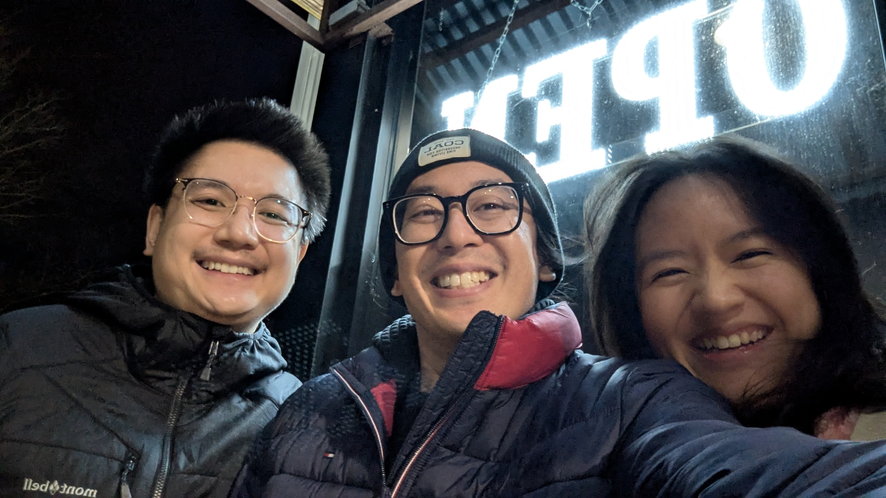
*I hadn't seen Tim and Christine since they moved to Colorado!*

My Dad made a bet with me that he could beat me in a 1650 (1 mile) swim since I was so out of shape and hadn't really swam in 17 years. The loser had to treat the family to King Spa. I won, but there was a lot at stake. My dad is 68. It took me 37 minutes. It really was a loss either way for me. I had to look up [my old HS swim times](https://www.pvswim.org/0708hs/2008ConcordeDistrict_m.htm). I was effectively 3x slower already. I worked out of King Spa for a day, but they wouldn't let me charge my laptop so I had to leave early.

And on New Years eve picked up my Grandma and Aunt from Dulles and got Grandma to her caretaker, packed, handed the frisbee league officially over to Alexis at Jireh Bakery in Centreville with Matt, drove back to Dulles, flew to Austin, got picked up by Massen, and headed to a New Years Party at Stevens where the same Slushie maker was a hit again! 

## 2025 Predictions: 

I was really wrong on my predictions and I think I shouldn't be so vague with them. I'll try to make 2026 predictions a bit more verifiable like the prediction markets on Kalshi. 

Trump did hint at ways to get a third term but he did not take action. He did install a militia on the people in certain cities, but he did not use the JFK papers to do so. 
There were no reports of autonomous weapons misfiring and misidentifying soldiers. Isreal hasn't formally annexed Gaza yet, because it does not want to have to feed or provide water to any survivors in the area. Russia DID use cryptos to circumvent some sanctions but it was not a long lasting loophole and they used almost as much Bitcoin as Ethereum so I couldn't give myself credit for that either. Korean is the fastest growing asian language on Duolingo but Japanese is the most learned overall. 
I gave myself credit for AOC talking about running for the presidency because it was vague and did not say she had to formally enter the race, but in an interview she entertained the idea of "stomping" JD Vance. 

- Trump solidifies plans for a third term ❌
- Trump removes the age limit for presidency ❌
- Trump sets stage for Barron Trump to take VP role ❌
- New class war between "Old Money" and "New Money" emerges ❌
- Israel declares second "state" in Gaza or formally annexes Gaza ❌
- First mass AI-friendly fire casualties reported ❌
- California secession talks begin ✅
- AOC talks about running for 2028 ✅
- Russia stockpiles Ethereum in response to US Bitcoin ❌
- JFK/MLK papers reveal government involvement, Trump uses it to install militia (HALF CREDIT)
- Korean surpasses Mandarin on Duolingo for Asian learners ❌

2026 Predictions: 
- Bitcoin > 150K at some point in 2026
- DC Breeze wins 2026 UFA championships
- GTA 6 delayed again until 2027
- Anutin Charnvirakul wins elections in Thailand
- AMD reaches 1T market cap
- Frieren wins anime of the year
- Luigi Mangione found guilty
- VanEck Vietnam ETF reaches $30 (from $18.42 1/1/2025)
- Chevron stock rises > 180
- KPOP Demon hunters voice actors will win a Grammy

# The Big 2025 Theme: China and Korea Wins
> Let China sleep, for when she wakes, she will shake the world” -Napoleon Bonaparte

I think COVID woke China up. They purposely let Evergrande die in 2023, and somehow turned the collapse into 7,500 miles of bullet-train rail in 2 years. BYD built their 7th frieight ship that could transport 7500 cars to any port,selling them for under $10K each

At the same time, everyone seemed to hit a very Chinese point in their life. People started downloading RedNote, half as a joke, half out of curiosity, and then realized how much prosperity was just… there. Speed toured China, won streamer of the year, and basically live-demoed how advanced the country actually is to an audience that wasn’t expecting it.

It’s rare for Asian memes to really overtake Western ones, but they did. Sister Hong. Tony the LC sign guy got promoted to Chief Marketing Officer.

For the last 10 years since Sundar Pichai took over Google, if a south Asian was head of a NASDAQ / NYSE tech company, it had a very good chance of doing well. But in 2025, if you had stock in a large Chinese / Taiwanese company you probably did >50% with NVDIA, AMD, Tencent, BABA. 

In a game of Civilization, I'd think China's economy is winning, while Korea is still pushing for a culture victory. Faker wins his 5th worlds title and KPOP Demon Hunters captures the hearts of everyone from families with toddlers to clubs remixing Golden.

It's been 7 years since Crazy Rich Asians came out.

## Songs from my Spotify

<iframe data-testid="embed-iframe" style="border-radius:12px" src="https://open.spotify.com/embed/track/3l8ACerUtJfRd0rxJJ4Gkx?utm_source=generator" width="100%" height="152" frameBorder="0" allowfullscreen="" allow="autoplay; clipboard-write; encrypted-media; fullscreen; picture-in-picture" loading="lazy"></iframe>
This song was on repeat after I played Dispatch. The party scene from the game made me second guess my decision to have a date with Blonde Blazer. 
<iframe data-testid="embed-iframe" style="border-radius:12px" src="https://open.spotify.com/embed/track/5gtoVdkR5k72kCdRNjTxq8?utm_source=generator" width="100%" height="152" frameBorder="0" allowfullscreen="" allow="autoplay; clipboard-write; encrypted-media; fullscreen; picture-in-picture" loading="lazy"></iframe>
Jasmine Kelly will text you back. 
<iframe data-testid="embed-iframe" style="border-radius:12px" src="https://open.spotify.com/embed/track/4U45aEWtQhrm8A5mxPaFZ7?utm_source=generator" width="100%" height="152" frameBorder="0" allowfullscreen="" allow="autoplay; clipboard-write; encrypted-media; fullscreen; picture-in-picture" loading="lazy"></iframe>
I met an asian guy who performed Vienna at a Karaoke night sometime in July. I have him saved as "Billy Joel" on my phone and I said we'd hang out but I think I was whisked away to New Jersey and then Arizona and its been too long. I've been inspired since. 

## Resolutions
I only managed to hit 3 of my last year's resolutions: 

I took the motorcycle classes (I know I said dance lessons last year, but it's a course. I never sign up for stuff. give this to me.)

On the last day of the year, Fairfax Ultimate was officially handed over.

I briefly learned Michael Wong's, Tong Hua, (Fairy Tale) on Piano earlier in the year, but didn't keep up practicing it. 

## Resolutions

1. This year I resolve to be able to bench, deadlift, and squat my own body weight, 5 reps. It's a pretty beginner goal, but the only gym I've ever really gone to is the climbing gym and my shoulder is still pretty sore from not PT'ing.

2. Read 6 books. I did almost no reading last year, which is pretty bad.

3. Play an intermediate piano song from memory. I've never done this in my life. When I was 12, I messed up my piano recital playing Canon in D, so this might just be impossible for me. 

4. Run a 7:30 mile. 

5. Grow the Moyae team! There's a lot that needs to happen for this to work

## EDIT
Since starting and editing this on 1/1/2026 - 1/3/2026, US has already bombed Caracas and captured Maduro. Editing prediction to Chevron stock rising to 180 since they're the only US oil producers in the area. It was wild because at midnight, Massen and I were just dropping pins on google maps looking at Caracos commenting on how indefensible a port city like that was, and moments later Maduro was captured.

