I was watching *American Gangster* this weekend. It's the one where Denzel plays Frank Lucas, the Harlem dealer who skipped the middlemen and shipped heroin home straight out of Southeast Asia during Vietnam. Somewhere in the movie it hit me. Lucas wasn't really self-made. He was downstream. The war that filled his pipeline was Henry Kissinger's war. The alliances that kept the heroin moving were Kissinger's alliances. Lucas got rich off the seams of American foreign policy.

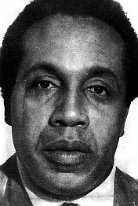
*Frank Lucas, mid-1970s. His own supplier said he was a customer, not the kingpin the film sells. (Public domain.)*

I have two of Kissinger's books on my shelf. *Diplomacy* and *World Order*. I didn't buy them as a fan. Anthony Bourdain put it best: "Once you've been to Cambodia, you'll never stop wanting to beat Henry Kissinger to death with your bare hands." I share the sentiment. I read the books to know the enemy.

So I started pulling the thread. If a Harlem dealer could profit off statecraft, the reverse had to be true somewhere too. Politicians. Banks. Whole governments, quietly profiting off the drug trade. I wanted to know how far back it went, and how far forward it runs.

This is that deep dive. It starts in the poppy fields that broke China in the 1800s. It moves to the Golden Triangle that funded Cold War armies. It runs through the cartel cash that bought its way toward a presidency, and ends in the Dutch labs and Chinese chemical plants making the drugs sold on the street tonight.

## A note on how I checked this

This topic attracts myth. The drug trade is the natural home of the unfalsifiable claim, the "everybody knows," the documentary that connects ten dots with one red string. I tried to be ruthless about it.

Every major claim here went through adversarial verification. For each one I had independent researchers try to *refute* it, not confirm it, and I kept only what survived. Some famous stories did not survive, and I name which ones, because the things that get cut are as revealing as the things that stay. Where the record is thin or contested, I say so in the text. Where a name appears, it carries a link to a court record, a government designation, or at least a reference page.

Two casualties up front, to set the standard. The loose, popular claim that the CIA's Air America ran Golden Triangle heroin to American streets as its own distribution business did not hold up in my checks. Something narrower did check out, and I will get to it: an early-1950s CIA operation that armed a Nationalist Chinese army whose contract planes flew opium out of the hills. The gap between those two claims is the whole discipline of this piece. The other casualty was the cleanest version of the Frank Lucas legend, that he personally flew to Bangkok and cut out the mob. The man was, by the account of his own supplier, a gifted self-mythologizer. I will come back to both.

## The opium that broke China was grown in India

Start with the irony that sets up everything else. The opium that destroyed China in the nineteenth century was not Chinese. It was British, and it was grown in India.

After the East India Company won the right to collect revenue in Bengal in 1765, it built a state monopoly over opium. [Warren Hastings](https://en.wikipedia.org/wiki/Warren_Hastings) centralized that control in 1773, and Regulation VI of 1799 banned private poppy cultivation outright, fixing how much each farmer planted, how much he delivered, and the price he got ([Cambridge, *Modern Asian Studies*](https://www.cambridge.org/core/journals/modern-asian-studies/article/poor-mans-crop-evading-opium-monopoly/199D0743201BF76C8ADA72F625B85FAD)). This was "Bengal opium," manufactured at the great factories of Patna and Ghazipur. It was a government product in all but name.

There was a second Indian source the Company did not control. In central India, the princely states of Malwa grew their own. Roughly three-quarters of that land sat under two Maratha dynasties, the [Scindias](https://en.wikipedia.org/wiki/House_of_Scindia) of Gwalior and the [Holkars](https://en.wikipedia.org/wiki/House_of_Holkar) of Indore. Malwa opium sold for about half the price of Bengal's and kept undercutting the monopoly, so the Company spent decades trying to buy it up or force it down ([Cambridge](https://www.cambridge.org/core/journals/modern-asian-studies/article/poor-mans-crop-evading-opium-monopoly/199D0743201BF76C8ADA72F625B85FAD)). Two regions, one buyer, one enormous market downstream.

That market was China. Private firms did the smuggling the Company preferred not to touch directly. The most famous was [Jardine Matheson](https://en.wikipedia.org/wiki/History_of_Jardine_Matheson_%26_Co.), a Scottish house that grew rich running Indian opium into Chinese ports. When the Qing commissioner [Lin Zexu](https://en.wikipedia.org/wiki/Lin_Zexu) seized and destroyed twenty thousand chests of it at Humen in 1839, Britain went to war to protect the trade. China lost, twice, and the century that followed is the one Chinese histories still call humiliating.

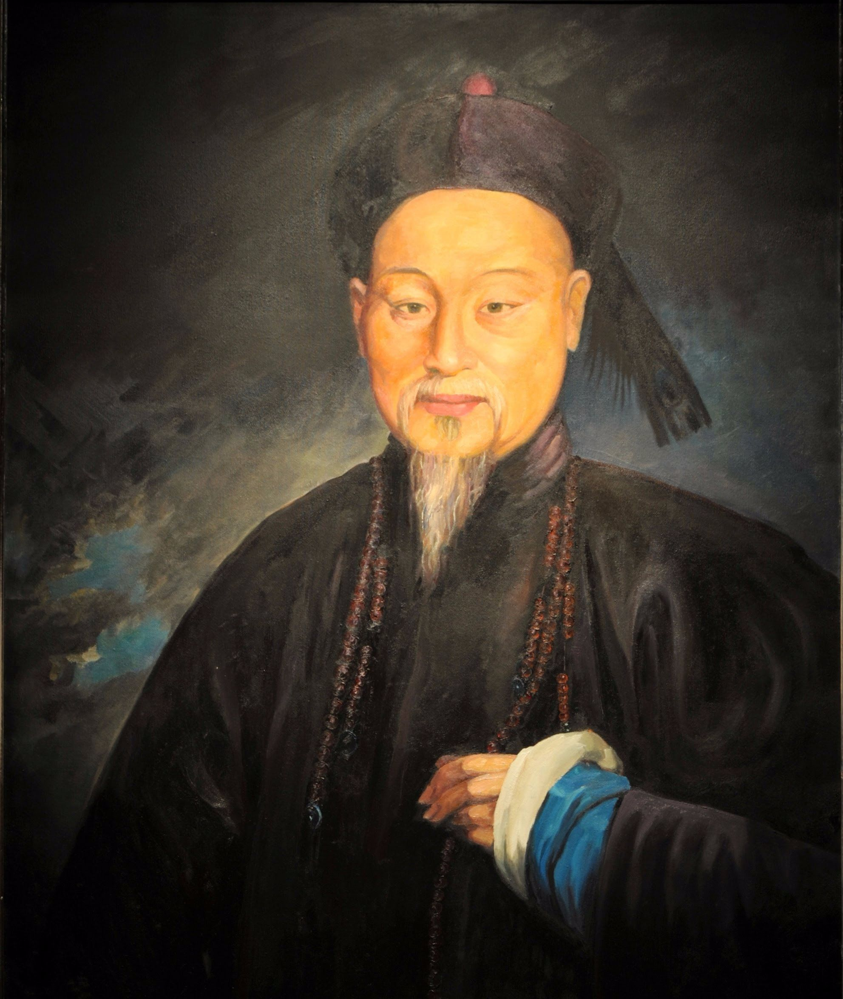
*Commissioner Lin Zexu. His 1839 opium burning triggered the First Opium War. (Portrait by Lam Qua, public domain.)*

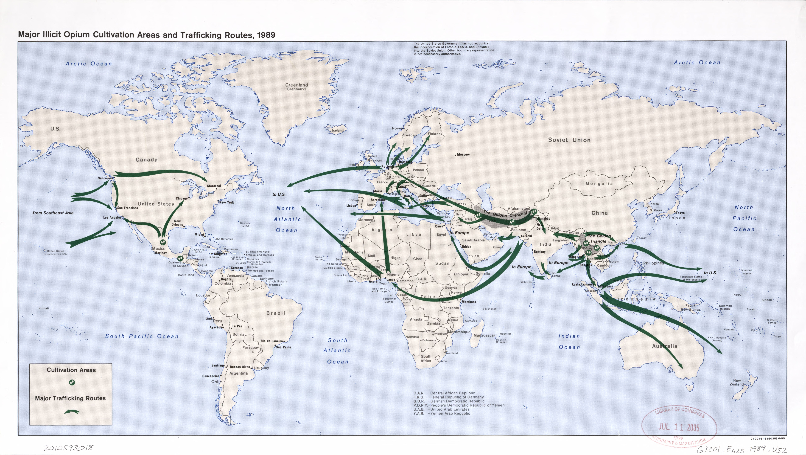
*[ Opium trading map]*

Hold onto the shape of this. A state organizes cultivation. A respectable firm moves the product. The profits build legitimate fortunes, and the damage lands somewhere far away. We will see that shape again.

## China's answer, and a frontier that walked south

China's response to the foreign opium flood was to grow its own. By the nineteenth century the poppy had spread across the southwest, into Yunnan, Sichuan, and Guizhou. Historians describe it as a "transimperial crisis" that forced the Qing into region-by-region prohibition campaigns well before the coastal trade with Britain even peaked ([Bello, *Journal of Asian Studies*](https://www.cambridge.org/core/journals/journal-of-asian-studies/article/abs/venomous-course-of-southwestern-opium-qing-prohibition-in-yunnan-sichuan-and-guizhou-in-the-early-nineteenth-century/C47749DF394E010B9032CB39C5C4E9DB)). China then ran one of the most effective drug-eradication campaigns in history between 1906 and 1917, ripping out crops by force. One historian argues that the sheer brutality of it helped fragment the country ([Windle, *International Journal of Drug Policy*](https://www.sciencedirect.com/science/article/abs/pii/S0955395913000303)).

So the poppy was in the southwest Chinese hills, right up against the Burmese border. Yunnan China is a lot like Vietnam. My anecedotal experience is that Chinese Yunnan noodles are just Vietnamese vermicelli, so... that is my expertise take. 

In 1949 the Communists won the civil war and crushed opium on the mainland. Defeated Nationalist (Kuomintang) units did not all flee to Taiwan. Beginning in December 1949, KMT troops crossed south out of Yunnan into the Shan hills of Burma, settling around Tachilek and Kengtung. By March 1950 the remnants of the 93rd Division and the 8th and 26th Armies, the 8th commanded by [General Li Mi](https://en.wikipedia.org/wiki/Li_Mi_(Republic_of_China_general)), were consolidated under his command. The force grew to roughly 12,000 men by 1953 ([Friedrich-Ebert-Stiftung archive](https://library.fes.de/libalt/journals/swetsfulltext/11448875.pdf)).

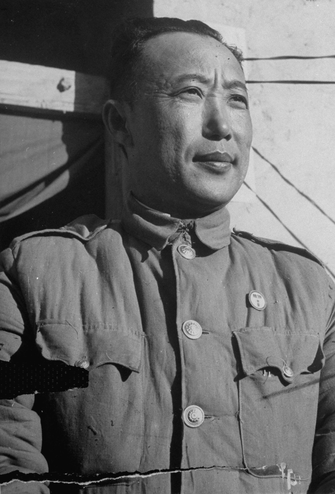
*General Li Mi, around 1950. (Photo by Jack Birns, public domain.)*

Opium already grew in those hills. The British had taxed it in colonial times. What the KMT did was industrialize it. They took administrative control of districts, imposed a compulsory opium tax on every hill-tribe farmer, and pushed for more. Annual production in the Burmese sector rose roughly twentyfold, from about 30 tons when they arrived to 300 to 600 tons by the mid-1950s ([Asia Pacific Media Services](https://asiapacificms.com/papers/pdf/gt_opium_trade.pdf); [Kuomintang in Burma](https://en.wikipedia.org/wiki/Kuomintang_in_Burma)). One commander, [General Tuan Shi-wen](https://www.taipeitimes.com/News/feat/archives/2025/05/20/2003837178), said the quiet part out loud: "We have to continue to fight the evil of communism, and to fight you must have an army, and an army must have guns, and to buy guns you must have money. In these mountains, the only money is opium."

This is where the CIA actually enters the story, and where precision matters. Through "Operation Paper," approved by President Truman, the agency armed Li Mi's men. Unmarked C-46 and C-47 planes flown by Claire Chennault's Civil Air Transport made parachute drops into a KMT airstrip at Mong Hsat from early 1951, and on the return leg the same planes carried out the opium the Nationalists were now growing ([Friedrich-Ebert-Stiftung archive](https://library.fes.de/libalt/journals/swetsfulltext/11448875.pdf); [McCoy, *The Politics of Heroin*](https://www.akha.org/content/drugwar/mccoy/29.htm)). Hold the claim exactly there. The United States armed the army that multiplied the poppy fields, and its contract airline hauled the product out. That is documented. The looser legend, that the CIA's later Air America ran the heroin to American streets as a distribution business, is the one I could not verify and left out.

So the poetic thesis survives, in its honest form. Not the same fields. A migrating frontier. The poppy economy moved from British India, to a domestic southwest-China industry, into the Golden Triangle, and a defeated Nationalist army, armed by Washington, was the vector that carried the trade across that last border and grew it twentyfold. The literal "same soil" version is a myth. To fight communism, we ended up importing dope. 

There is a second thread of continuity that I *did* verify, and it is lovely. The French ran their colony in Indochina partly on opium, just a little further south. The colonial [Opium Régie](https://hal.science/hal-04763386v1), restructured into a serious revenue engine under Governor-General [Paul Doumer](https://en.wikipedia.org/wiki/Paul_Doumer), bought most of its raw opium at auction in Calcutta, from the British. It refined the stuff in Saigon and sold it through licensed dens. Opium revenue averaged about twenty-four percent of the entire Indochina general budget between 1898 and 1945, and by itself covered the colony's debt payments into the 1930s ([*Histoire & Mesure*](https://hal.science/hal-04763386v1)). The French state was not laundering drug money. It was funded by drug money, by statute, openly, on the books.

That is the thing English-language histories tend to skip. Before there were cartels laundering cash into banks, there were empires running their budgets on the drug directly. The launderer and the launderee were the same office.

## The Golden Triangle and the war that came home

By the time American soldiers were in Vietnam, the Golden Triangle was a mature heroin economy with its own royalty just 15 short years later. 

The most famous was [Khun Sa](https://en.wikipedia.org/wiki/Khun_Sa), the half-Chinese, half-Shan warlord the press called the "Opium King," who at his peak commanded a private army in the Shan hills and was blamed for a large share of the heroin reaching the United States. Before and alongside him was [Lo Hsing Han](https://en.wikipedia.org/wiki/Lo_Hsing_Han), another "Godfather of Heroin" whose family later turned into a legitimate Burmese business empire. His successors in the trade, the [United Wa State Army](https://home.treasury.gov/news/press-releases/hp1268), are now sanctioned by the US Treasury as one of the largest trafficking organizations in Southeast Asia.

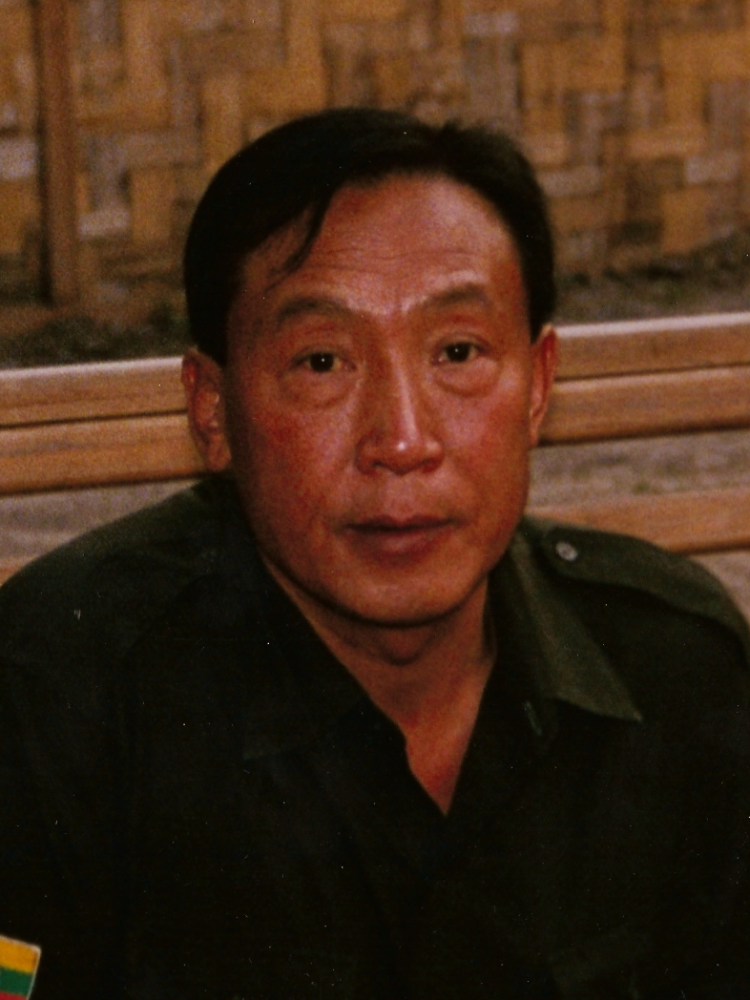
*Khun Sa, the warlord the press called the Opium King. (Photo: Stephen Rice, CC BY-SA 3.0.)*

The route to the customer ran through Europe first. Part of the famous "French Connection," the Marseille heroin pipeline, was fed by Corsican syndicates that had grown up inside French colonial Saigon and shipped the product west ([McCoy](https://www.druglibrary.net/schaffer/heroin/McCoy2.htm)). Colonial Indochina, again, sitting underneath the modern trade.

Which brings us back to Frank Lucas, and to the correction I promised. The movie sells a lone genius who flew to Asia and bought direct. The duller truth is that his real connection was a man named [Leslie "Ike" Atkinson](https://en.wikipedia.org/wiki/Ike_Atkinson), an Army veteran the DEA nicknamed "Sergeant Smack," who used US military logistics out of Bangkok to move heroin home between roughly 1968 and 1975. [Lucas](https://en.wikipedia.org/wiki/Frank_Lucas) was one of his American customers, not the source. By Atkinson's own account, Lucas inflated his role for the cameras. The "cadaver connection," heroin smuggled inside dead servicemen's coffins, is almost certainly part of that inflation.

What is true, and what matters for my thesis, is where the money went. Lucas parked his profits in legitimate property. Office buildings in Detroit. Apartments in Los Angeles and Miami. A ranch of several thousand acres in North Carolina. When he was arrested the seizures stretched across several states. A street dealer was already turning heroin into real estate, which is laundering at the retail scale. Higher up the chain, the same instinct built a bank: the [Nugan-Hand Bank](https://www.druglibrary.net/schaffer/heroin/McCoy2.htm) became a conduit linking the Golden Triangle trade to markets in Australia, a smaller cousin to the global story coming next.

This is where the war connects to the man who ran it. The Golden Triangle was not an accident of the Cold War. It was a method. Whenever a drug-running force happened to be anti-communist, the United States tended to arm it, shield it, and look past the product. The enemy of my enemy was a friend, even when the friend sold heroin.

In Laos, on Kissinger's watch as Nixon's national security adviser, the CIA raised a secret army of around 30,000 Hmong under General Vang Pao to fight the communist Pathet Lao, and treated their opium crop as a reward for loyalty. The agency's own director, William Colby, later admitted it knew and did little ([McCoy, *The Politics of Heroin*](https://www.druglibrary.net/schaffer/heroin/McCoy2.htm)). The heroin off those hills was the high-grade Number 4 that reached the US Army itself. By September 1971, urine tests on soldiers heading home found that about one in five had been using heroin in country, and nearly half had tried opium or heroin at least once ([Robins, *AJPH*](https://ajph.aphapublications.org/doi/pdf/10.2105/AJPH.64.12_Suppl.38)). The war was poisoning its own troops while it was still being fought.

Kissinger stated the logic behind all of it more plainly than anyone. Weighing in 1970 whether to let Chile elect a Marxist, he told the committee that approved covert operations, "I don't see why we need to stand by and watch a country go communist due to the irresponsibility of its own people" ([National Security Archive](https://nsarchive.gwu.edu/briefing-book/chile/2024-09-09/cia-chile-scandal-50)). A nation's own vote was a detail next to the board. That same year he relayed Nixon's order for the secret bombing of Cambodia in seven words, "anything that flies on anything that moves" ([The Intercept](https://theintercept.com/2023/05/23/kissinger-phone-call-transcripts/)), the campaign Bourdain meant, the one that helped crack the country open for the Khmer Rouge. Order first, and the costs were always for someone else, later. Nobody had to write Frank Lucas into a memo. The doctrine had already done the work.

## Sicily's pizzerias and the heroin in the dough

Cross to the established side of the Atlantic and the laundering gets more sophisticated.

Through the early 1980s, the Sicilian Mafia ran heroin into the United States using pizzerias and Italian restaurants as fronts and cash registers. Investigators called it the [Pizza Connection](https://en.wikipedia.org/wiki/Pizza_Connection_Trial). The ring moved on the order of 1.6 billion dollars in heroin and laundered the proceeds, much of it through Swiss banks in Lugano and Zurich.

The cast is worth naming. [Gaetano Badalamenti](https://en.wikipedia.org/wiki/Gaetano_Badalamenti), an exiled Sicilian boss, ran the supply side from as far away as Brazil. [Salvatore Catalano](https://en.wikipedia.org/wiki/Pizza_Connection_Trial) anchored the American distribution. The man who handled the money, [Vito Roberto Palazzolo](https://en.wikipedia.org/wiki/Vito_Roberto_Palazzolo), was convicted of money laundering by a Swiss court in 1985, which is the court-proven core of the whole scheme. The case cracked open partly because of [Tommaso Buscetta](https://en.wikipedia.org/wiki/Tommaso_Buscetta), the first major Mafia boss to break the code of silence and talk.

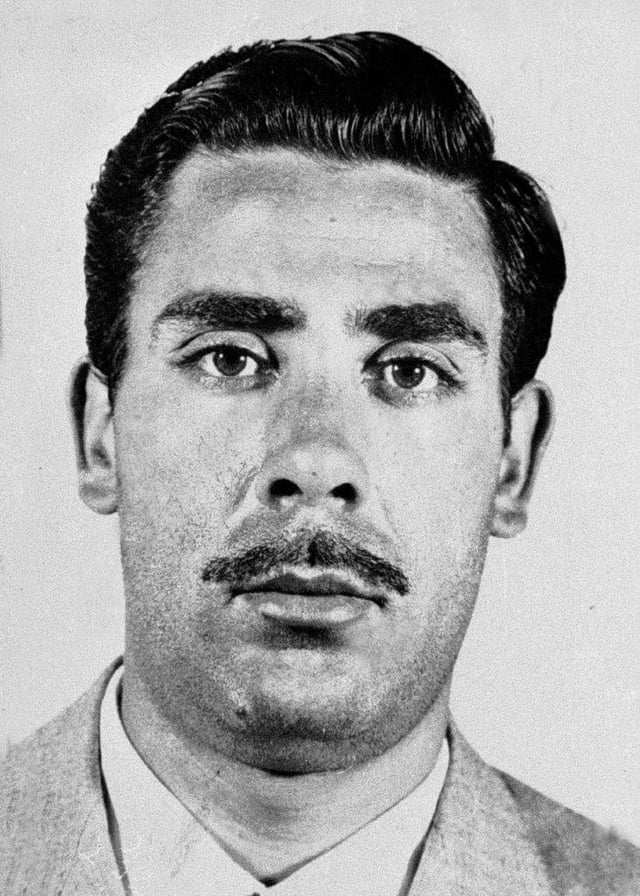
*Tommaso Buscetta, the first major Mafia boss to break omertà. (Public domain.)*

The prosecution is a piece of trivia that lands differently today. It was run out of New York by a young US Attorney named [Rudolph Giuliani](https://en.wikipedia.org/wiki/Rudy_Giuliani), with [Louis Freeh](https://en.wikipedia.org/wiki/Louis_Freeh), later FBI Director, as a lead prosecutor. Badalamenti and Catalano got forty-five years each in 1987.

The Italian sources are blunter than the American ones about what came next. The anti-Mafia parliamentary commissions in Italy spent decades documenting how Cosa Nostra recycled drug profits back into the legitimate economy, into construction, retail, and finance, until the cleanest money in a Sicilian town might trace back to heroin. That is the through-line. The crime does not stay a crime. It becomes a business.

## The bank that laundered for a cartel

The single clearest case of the gutter buying its way into the establishment is a bank most people have never heard of.

The [Bank of Credit and Commerce International](https://en.wikipedia.org/wiki/Bank_of_Credit_and_Commerce_International), founded by the Pakistani financier [Agha Hasan Abedi](https://en.wikipedia.org/wiki/Agha_Hasan_Abedi), was at its peak the seventh-largest private bank in the world, operating in 78 countries with more than 20 billion dollars in assets. It was not a back-alley operation. It was a global institution with respectable clients and political access on several continents.

It was also, in the words of a 1992 US Senate investigation led by Senator John Kerry, a bank that adopted a conscious corporate policy of soliciting drug money. The [Kerry Committee report](https://irp.fas.org/congress/1992_rpt/bcci/04crime.htm) found BCCI laundered for the leadership of the Medellín cartel, including Pablo Escobar, Gonzalo Rodríguez Gacha, and members of the Ochoa family, and managed some 23 million dollars in criminal proceeds for the Panamanian dictator [Manuel Noriega](https://en.wikipedia.org/wiki/Manuel_Noriega) out of its London branches. One BCCI officer testified plainly: "We knew that the money that we would be getting in Colombia would be drug money." The bank used certificates of deposit at foreign branches to offset US cash and credited "counter-balancing loan proceeds" to accounts the traffickers named.

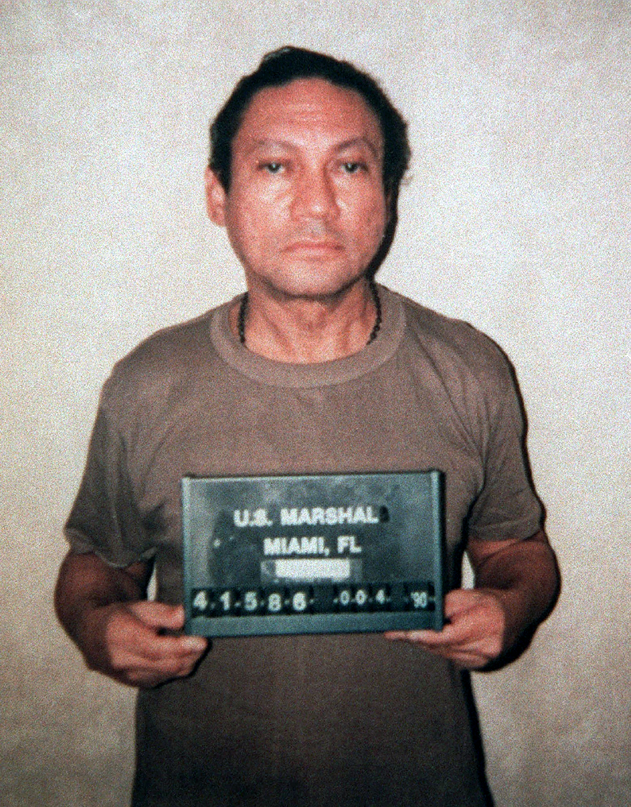
*Manuel Noriega, 1990 booking photo. (US Marshals Service, public domain.)*

It came apart because of a US Customs agent named [Robert Mazur](https://irp.fas.org/congress/1992_rpt/bcci/08just.htm), who spent two years undercover as a mob-connected businessman in Operation C-Chase. He recorded the laundering of more than 34 million dollars, and the 1988 indictments hit BCCI officers and corporations across a map that ran from Tampa through Panama and the Bahamas to Switzerland, Liechtenstein, and London ([US District Court, M.D. Fla.](https://www.flmd.uscourts.gov/it-happened-here-tampa)).

John Kerry's subcommittee was not only auditing a bank. The same 1989 investigation found that America's anti-communist wars had a drug habit of their own. In Nicaragua, Contra pilots and suppliers ran narcotics while US officials, in the report's words, "failed to address the drug issue for fear of jeopardizing the war." The State Department paid 806,000 dollars to four companies controlled by traffickers to fly aid to the Contras, some of them paid after they had already been indicted ([Kerry Committee report](https://en.wikipedia.org/wiki/Kerry_Committee)). And Noriega, the dictator whose millions BCCI was busy washing, had been a paid CIA asset for years, protected for as long as he was useful and invaded once he was not. The bank and the wars were the same lesson taught twice. Drug money was tolerable as long as it served the larger fight.

## When the money bought a government

Colombia is where the money stopped hiding behind banks and walked into the presidential palace.

In 1989 US prosecutors in Atlanta broke a laundering ring they called La Mina, the Mine, a setup slick enough to wash up to 28 million dollars every 45 days. At the center sat [Banco de Occidente](https://www.infobae.com/colombia/2023/10/11/la-condena-contra-el-grupo-aval-por-lavar-dinero-para-pablo-escobar-y-el-cartel-de-medellin-que-pocos-conocian/), a Colombian bank then tied to one of the country's great financial families. The bank entity pleaded guilty to laundering more than 412 million dollars for the Medellín cartel and [Pablo Escobar](https://en.wikipedia.org/wiki/Pablo_Escobar). The cartel's money manager, [Eduardo Martínez Romero](https://www.deseret.com/1989/8/22/18820678/colombia-arrests-a-leader-of-medellin-drug-cartel/), was flown north as one of the first Colombians ever extradited, a bookkeeper of other people's blood money who had turned a chartered bank into a rinse cycle.

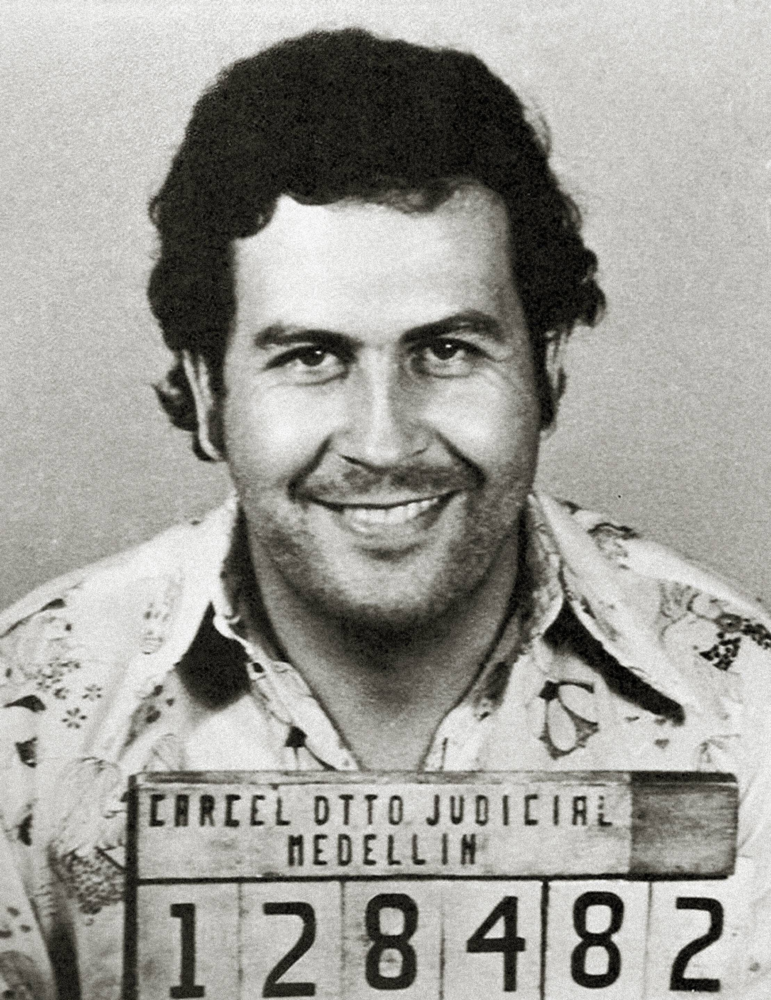
*Pablo Escobar's police mugshot. (Colombian National Police, public domain.)*

Here is where an American hand enters, and it is the most direct in this whole piece. Lay the events end to end, in order.

By the late 1980s the enemy was Pablo Escobar's Medellín cartel, and Washington paid to destroy it. A secret US Army signals unit, Centra Spike, tracked Escobar's radio. Delta Force trained the Colombian police unit called the Search Bloc. DEA agents ran the informants ([Bowden, *Killing Pablo*](https://groveatlantic.com/book/killing-pablo/)). At the same time, a death squad called Los Pepes was killing Escobar's relatives and associates by the hundreds. Los Pepes was run by the paramilitary trafficker Carlos Castaño and paid for by the [Cali cartel](https://en.wikipedia.org/wiki/Los_Pepes), Escobar's rival, and it traded targets and intelligence with the same Search Bloc the Americans were funding.

On 2 December 1993 the Search Bloc shot Escobar dead on a Medellín rooftop. Medellín fell apart, and the Cali cartel stepped into its place, within a couple of years moving an estimated 80 percent of the cocaine reaching the United States. State it plainly. American money and intelligence helped destroy one cocaine empire by arming a unit that worked beside a death squad the rival empire was funding, and the war's lasting result was a fresh supplier for the same American market. The drug war did not clean the trade. It crowned the winner.

Then the winner bought a country. In 1994 the [Cali cartel](https://www.infobae.com/america/colombia/2022/06/01/el-cartel-de-cali-los-rodriguez-orejuela-samper-y-el-proceso-8000/), run by the brothers [Gilberto](https://en.wikipedia.org/wiki/Gilberto_Rodr%C3%ADguez_Orejuela) and [Miguel Rodríguez Orejuela](https://en.wikipedia.org/wiki/Miguel_Rodr%C3%ADguez_Orejuela), put at least 3.7 million dollars into the presidential campaign of [Ernesto Samper](https://en.wikipedia.org/wiki/Proceso_8000), and he won. The proof was on tape. The losing candidate, Andrés Pastrana, was slipped a set of recordings, the narcocasetes, on which a cartel-friendly journalist and the brothers themselves talk through the money going to Samper, and he carried them straight to the prosecutor ([Señal Memoria](https://www.senalmemoria.co/proceso-8000-historia-politica)). The investigation got a file number, 8000, and the country has called the whole affair Proceso 8000 ever since.

What happened next is the part that stays with me. The campaign's treasurer, [Santiago Medina](https://en.wikipedia.org/wiki/Proceso_8000), and its manager, [Fernando Botero Zea](https://en.wikipedia.org/wiki/Fernando_Botero_Zea), who by then was Samper's defense minister, both went to prison. In January 1996 Botero went on television from his cell and said Samper had not just known about the cartel money, he had helped bring it in. Samper's whole defense came down to a single phrase that turned into a national punchline: the money, he said, had arrived "a mis espaldas," behind his back, without his knowledge. In June 1996 the Chamber of Representatives voted 111 to 43 to close the case against him. He finished his term in office. Two years later the man who had carried in the tapes, [Andrés Pastrana](https://en.wikipedia.org/wiki/Andr%C3%A9s_Pastrana_Arango), was elected president.

The limits matter, so here they are. The convictions of the staff and the fact of the cartel funding are court-established. Samper's own guilt was sworn to by his lieutenants and then wiped away by a congressional vote that most Colombians read as a political bargain. He died of none of it. The worst thing the cartel's money ever cost the man at the top of the government was a phrase he never managed to outrun.

## Afghanistan: from warlords to governors

Afghanistan ran the same play, with the seams showing more.

For two decades it grew most of the world's opium, and the money climbed by two routes. The first was *hawala*, the centuries-old transfer system in which no cash actually crosses a border. A trader hands dollars to a broker in Kandahar, who phones a broker in Dubai, and a chit and a lifetime of trust settle the rest later. One UK government study found the same hawala dealers moving funds for aid agencies, banks, warlords, and smugglers, sometimes in the same afternoon ([Crisis States, GOV.UK](https://assets.publishing.service.gov.uk/media/57a08b2ced915d622c000b5b/WP83.2.pdf)). When investigators raided the New Ansari money-exchange network in Kabul, they were staring at billions of dollars that had left the country through that one pipe, with drug profit and reconstruction aid running together in the same stream and no clean way to tell them apart.

The second route skipped laundering altogether. After 2001 the men who controlled the trade did not have to wash their way into the state. They were handed it. Drug- and border-financed commanders took jobs as provincial governors, police chiefs, and members of parliament, a pattern scholars dryly labeled "warlord democratisation." The plainest example is [Sher Mohammad Akhundzada](https://en.wikipedia.org/wiki/Sher_Mohammad_Akhundzada), governor of Helmand, the most opium-soaked province on earth, until 2005, when nearly ten tons of opium were found in his offices. He was pushed out under British pressure and then seated as a senator. The older Pakistani smuggling baron [Ayub Afridi](https://en.wikipedia.org/wiki/Ayub_Afridi_(drug_lord)), who had helped move the heroin that bankrolled the anti-Soviet jihad, made the same journey from wanted man to useful friend of the government.

The seam runs back further than 2001, to the war that built the modern Afghan heroin trade. Fighting the Soviets in the 1980s, the CIA routed more than a billion dollars in weapons through Pakistan's intelligence service to [Gulbuddin Hekmatyar](https://en.wikipedia.org/wiki/Gulbuddin_Hekmatyar), more than any client in the agency's history. Hekmatyar became, for a time, arguably the world's biggest heroin trafficker, running refineries on Helmand poppy. A billion dollars in arms, handed to a man building heroin labs, in a decade when the most a person could legally give an American candidate was a thousand dollars an election. Washington had the reports and chose not to look. The Washington Post's 1990 headline put it flatly: "[U.S. Declines to Probe Afghan Drug Trade](https://www.washingtonpost.com/archive/politics/1990/05/13/us-declines-to-probe-afghan-drug-trade/f07eadd2-3d25-4dd5-9e8c-05beed819769/)." The habit held into the next war. In 2009 the New York Times reported that Ahmed Wali Karzai, brother of the sitting Afghan president and a suspected figure in the opium trade, had been on the CIA payroll for years, running a paramilitary strike force in Kandahar ([NPR](https://www.npr.org/2009/10/28/114247634/president-karzais-brother-on-cias-payroll)). The same ground the Kuomintang had seeded sixty years before, the same arrangement.

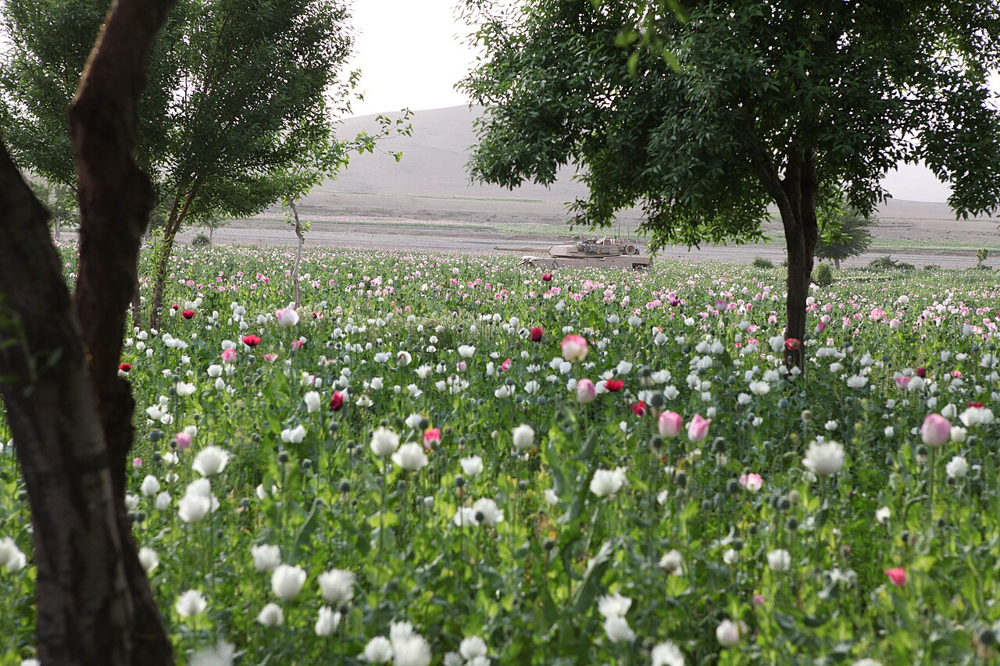
*A US Marine in a Helmand poppy field, 2012. (US Marine Corps, public domain.)*

Follow the money down to the dirt and it ends with the people holding the least of it. UNODC estimated that 76 percent of Afghan opium income went to the traffickers and refiners, and 24 percent to the farmers who actually grew the poppy. When the Taliban banned cultivation in 2022, the bottom of the chain is where the wound opened first. Cultivation fell about 95 percent in a single year, from 233,000 hectares to under 11,000, and the farmers' income dropped by more than 92 percent ([UNODC 2023](https://www.unodc.org/documents/crop-monitoring/Afghanistan/Afghanistan_opium_survey_2023.pdf)), while the stockpiles already sitting in traffickers' warehouses only grew more valuable as the price climbed.

The poppy did not retire. By 2025, with Afghanistan beaten down, Myanmar had taken back the title of the world's largest opium source, its cultivation up 17 percent to 53,100 hectares ([UNODC World Drug Report 2025](https://www.unodc.org/documents/data-and-analysis/WDR_2025/WDR25_B1_Key_findings.pdf)). The same hills the Kuomintang had seeded seventy years before were back at work.

## The pattern keeps its job at modern banks

It would be comforting to think this all ended with BCCI. It did not.

In 2010 [Wachovia](https://www.justice.gov/archive/usao/fls/PressReleases/2010/100317-02.html), then one of the largest banks in the country, admitted it had failed to police more than 378 billion dollars that moved through Mexican casas de cambio, the storefront currency-exchange houses the cartels use to push cash into the banking system, plus billions more in dollars carried physically over the border in bulk. The Justice Department let it sign a deferred prosecution agreement. Wachovia forfeited 110 million dollars and paid a 50 million dollar fine, and not a single banker was charged. Two years later HSBC paid 1.9 billion to settle its own version, having moved money for the Sinaloa and Norte del Valle cartels, among others.

I cannot prove whose money most of that 378 billion was, and I would rather say so than pretend otherwise. But we know where a piece of it went, because a plane fell out of the story. On 10 April 2006, Mexican soldiers opened up a DC-9 that had set down at Ciudad del Carmen on the Gulf coast and pulled out 128 suitcases holding 5.7 tons of cocaine. When investigators traced the paperwork behind the aircraft, the money that bought it ran back through a Mexican exchange house and into Wachovia, and the plane belonged to the Sinaloa cartel ([The Guardian](https://www.theguardian.com/world/2011/apr/03/us-bank-mexico-drug-gangs)).

So picture the rest of it the way I do, and treat this part as inference rather than a court finding. The exchange houses along that border were the cash registers of the Sinaloa and Juárez organizations, the people flying cocaine north and trucking currency back south by the ton. Some real fraction of that 378 billion dollars was almost certainly Joaquín Guzmán's, sitting in an American bank, looking exactly like everyone else's deposit. No prosecutor ever put a kingpin's name on a specific transfer. Wachovia was charged with failing to look, which is a smaller and safer thing than knowing, and it is what these cases almost always settle on.

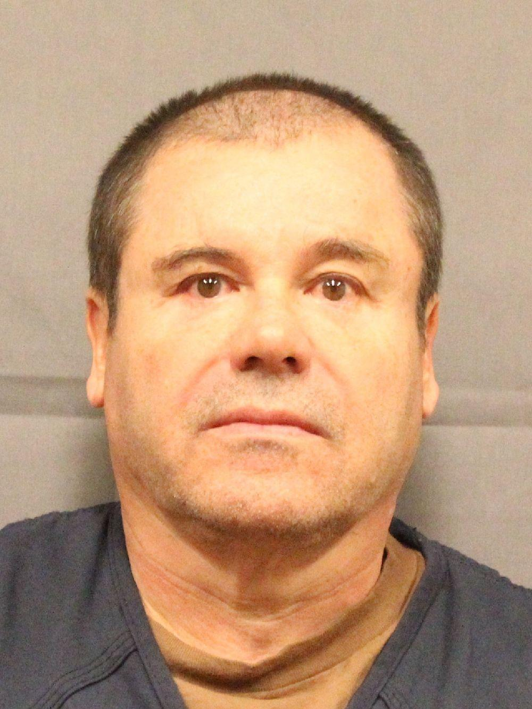
*El Chapo in custody, 2016. The seized DC-9 belonged to his Sinaloa cartel. (US DEA, public domain.)*

The one man who did look was named Martin Woods. He had spent eighteen years in British law enforcement, first as a detective on the London Metropolitan Police drug squad, then as a fraud investigator with the National Crime Squad, before Wachovia hired him into its London office in 2005 as a money-laundering reporting officer. What caught his eye were the travellers cheques coming in from the Mexican exchange houses: very large sums, in sequentially numbered cheques, signed in the same dubious handwriting, with the customer identification missing or junk. He knew the pattern from his police years. Across 2006 and 2007 he filed report after report, formal Suspicious Activity Reports, about fifty of them naming the Mexican casas de cambio as conduits for drug money. The client he kept naming was Casa de Cambio Puebla, a long-standing Wachovia customer that had pushed hundreds of millions of dollars through its accounts. He flagged Russian and Eastern European money on the side.

His own bank treated him, not the money, as the thing to be managed. Rather than chase what he had reported, Wachovia's managers accused him of overstepping, even of breaching confidentiality by filing the very reports the law required of him, and they iced him out until he resigned in May 2009. He took the bank to a UK tribunal as a whistleblower and settled. His vindication came in public the next year. The 2010 settlement confirmed Wachovia had failed to monitor 378.4 billion dollars moving out of Mexican exchange houses between 2004 and 2007, the exact pipe he had spent two years pointing at. And Casa de Cambio Puebla, the client he had named over and over, was the one investigators tied to the money that bought the DC-9 at Ciudad del Carmen.

## When the field disappears

Here is the turn I did not expect when I started, and the part that ties the old world to the world right now.

The modern drugs broke the map. There is no poppy valley behind a Molly pill, no coca slope behind a gram of fentanyl. The raw material is industrial chemicals shipped in labeled drums, and the only geography that still matters is wherever the lab happens to be rented this season.

Take the assumption I started with, that Molly and ketamine are mostly Russian. The records say no, and it is not close. Large-scale MDMA production sits in the Netherlands and Belgium, in the flat farm country straddling their border. Of 92 ecstasy labs that European police dismantled between 2019 and 2021, 57 were Dutch and 19 Belgian, and Russia is named nowhere as a producer ([EUDA](https://www.euda.europa.eu/publications/eu-drug-markets/mdma/production_en)). These are not kitchen setups. They are industrial plants hidden in barns and sheds, fed by a precursor called PMK-glycidate that arrives from China mislabeled as something dull through the docks at Rotterdam and Antwerp, and they generate so much toxic sludge that dumped drums of it turn up in Dutch ditches and nature reserves. Europe makes the world's ecstasy and ships it out, not the other way around.

The crews that run it are Dutch, and the violence has climbed the ladder alongside the money. The long Marengo trial of [Ridouan Taghi](https://en.wikipedia.org/wiki/Ridouan_Taghi), the Dutch-Moroccan boss now serving a life sentence, is ringed by killings, among them the crime reporter [Peter R. de Vries](https://en.wikipedia.org/wiki/Murder_of_Peter_R._de_Vries), shot on an Amsterdam street in 2021 while advising a witness against him. I will stay honest about the seam. The EU's own reports say "Dutch criminal networks" and do not put Taghi's name on the production lines. What is not in dispute is that the quiet country manufacturing the planet's party drug is also one where a journalist can be shot in daylight for getting close to the people who run it.

Ketamine is the same shape aimed at a different country. Most of what surfaces in Europe is real pharmaceutical ketamine made in India, produced legally and then bled out of the supply chain somewhere along the way, with Dutch groups again doing the distributing ([EUDA](https://www.euda.europa.eu/news/2026/new-eu-report-ketamine-published_en)). No field, often not even a lab. A hospital anesthetic walked quietly out a side door.

So where does Russia actually sit on this map? On a drug most Westerners have never heard of. The Russian-speaking market runs on mephedrone and other synthetic "salts," cooked at home from Chinese precursors. In one count of 417,000 drug stashes advertised across Russia in April 2020, mephedrone was the single most common product, ahead of cannabis and amphetamine ([GI-TOC, *Breaking Klad*](https://globalinitiative.net/wp-content/uploads/2024/11/Max-Daly-Patrick-Shortis-Breaking-Klad-Russias-dead-drop-drug-revolution-GI-TOC-November-2024.pdf)). The market that built it was [Hydra](https://home.treasury.gov/news/press-releases/jy0701), a Russian-language site with roughly 17 million customer accounts and an estimated 1.7 billion dollars in revenue in 2021. Hydra mailed nothing. It ran on the *klad*, the buried stash. Gig-work couriers called kladmen tuck magnetized little packages behind drainpipes, under park benches, into snowbanks, photograph the hiding place, and the buyer goes and digs it out. German and American police took Hydra's servers down in April 2022, and Russian police picked up its alleged administrator in Moscow. So the reader who guessed something Russian was half right, on the wrong drug. Not Molly in a baggie. Mephedrone under the snow.

The drug now killing the most Americans closes the loop back to where this whole thing began. Fentanyl is cooked from Chinese precursor chemicals, shipped to Mexico, and pressed into counterfeit pills by the Sinaloa organization of [Joaquín "El Chapo" Guzmán](https://www.justice.gov/usao-edny/pr/joaquin-el-chapo-guzman-sinaloa-cartel-leader-sentenced-life-prison-plus-30-years) and the CJNG of [Nemesio "El Mencho" Oseguera](https://www.state.gov/nemesio-ruben-oseguera-cervantes-el-mencho-2). The volumes are hard to picture. In 2024 the Justice Department charged a Sinaloa faction it called the largest known fentanyl-producing network in the world, and one raid that December pulled 1,500 kilograms of it out of a single stash in Sinaloa, the largest fentanyl seizure ever recorded ([US DOJ](https://www.justice.gov/opa/pr/sinaloa-cartel-leaders-charged-narco-terrorism-material-support-terrorism-and-drug)). And in the Shan hills of Myanmar, the [United Wa State Army](https://home.treasury.gov/news/press-releases/hp1268) that inherited the Kuomintang's old poppy ground has retooled it for methamphetamine, running some of the largest meth labs anywhere on earth. The fields the Nationalists first taxed in 1950 never left the trade. They just cook a different drug now.

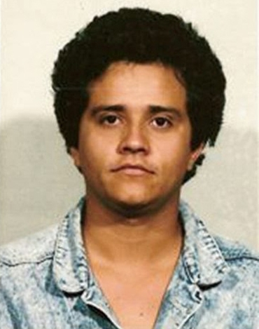
*Nemesio "El Mencho" Oseguera, head of the CJNG. (Public domain.)*

There is a dark symmetry in it. The story opened with China on the receiving end of a drug grown and shipped by a foreign power, and it arrives, two centuries later, at China as the source of the precursor chemistry killing Americans. I am not going to dress that up as fate. But it is hard to read the two ends of this together and feel nothing.

## After RICO, the villains went legitimate

There is a tidy bookend to the mob story, and it carries a name from earlier in this piece. Rudolph Giuliani.

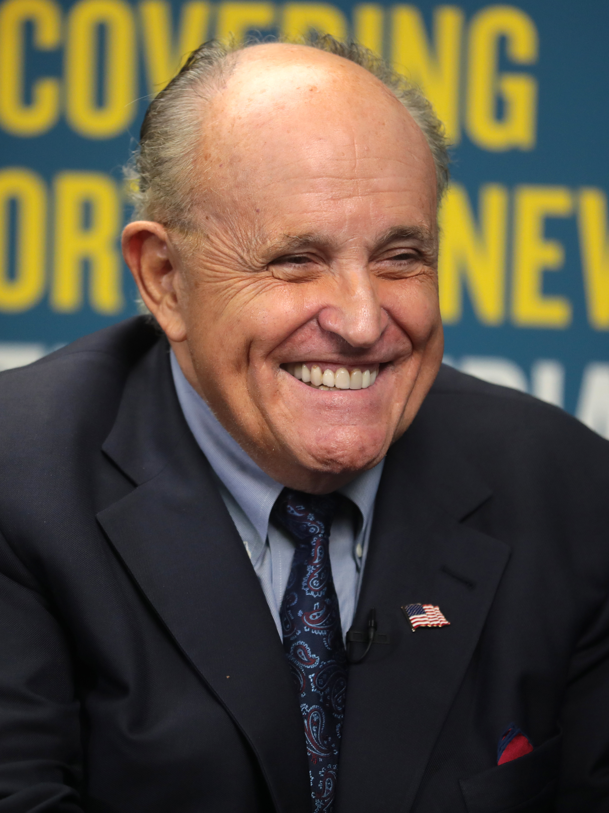
*Rudy Giuliani. The only free photo of him is a recent one, long after his prosecutor days. (Photo: Gage Skidmore, CC BY-SA 2.0.)*

The same prosecutor who ran the Pizza Connection used a 1970 law called RICO, the Racketeer Influenced and Corrupt Organizations Act, to go after the bosses directly. For its first decade nobody quite knew what to do with it. FBI Director William Webster admitted as much: "We had RICO for almost 10 years before we knew what to do with it" ([Mob Museum](https://themobmuseum.org/blog/the-bosses-of-the-mafia-commission-were-indicted-40-years-ago/)). Then, in the [Mafia Commission Trial](https://en.wikipedia.org/wiki/Mafia_Commission_Trial) of 1985 and 1986, Giuliani charged the heads of New York's [Five Families](https://en.wikipedia.org/wiki/Five_Families) as a single criminal enterprise. The bosses, Fat Tony Salerno, Tony Ducks Corallo, Carmine Persico, were convicted and sentenced to a hundred years each. RICO is the law that broke the traditional American Mafia.

So the families looked for the exit, and the exit was respectability. This is where the folklore starts, and I want to be careful, because one of the most repeated versions is false. People love to say Joseph Kennedy built the family fortune bootlegging during Prohibition. His own biographer chased every version of it and found nothing. "All of the stories about his bootlegging were just farcical," David Nasaw said. The money came from banking, Hollywood, the stock market, and legal liquor importing after 1933 ([History](https://www.history.com/articles/joseph-kennedy-wealth-alcohol-prohibition)). A dynasty built mostly clean, with a dirty legend stapled on. Worth remembering whenever the laundering story gets too tidy.

The documented version of going legit is quieter. Watch Las Vegas. Through the 1960s the Strip ran on hidden ownership. Then Howard Hughes moved into a suite at the Desert Inn, refused to leave, and bought the place, then bought the Sands, the Frontier, the Landmark. Hundreds of millions of dollars of casinos, folded into a licensed corporation ([Las Vegas Sun](https://lasvegassun.com/news/2008/may/15/how-vegas-went-mob-corporate/)). The mob did not get arrested out of Vegas so much as bought out of it. Corporations took the thing over and made it legal. The skim became a dividend.

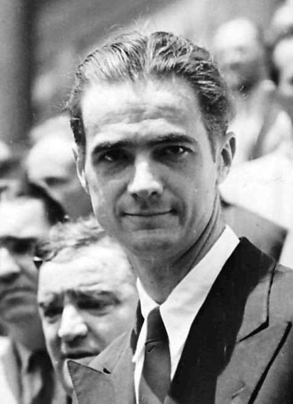
*Howard Hughes, around 1940. (Acme Newspictures, public domain.)*

That is the real arc of this story. The money did not go back to the gutter after RICO. It went up the stairs, put on a suit, and waited a generation. Moe Dalitz ran liquor and gambling for the Cleveland Syndicate and sat at the 1929 underworld summit with Capone and Lansky, then remade himself in Las Vegas as a casino builder and civic donor, honored in his last years as a philanthropist ([Mob Museum](https://themobmuseum.org/notable_names/moe-dalitz/)).

The cleaner the laundering, the longer the timeline. Samuel Bronfman spent Prohibition shipping Canadian liquor to American bootleggers, with Meyer Lansky and Frank Costello among the customers. When repeal came he kept the brands, Chivas Regal, Crown Royal, Seagram's, and grew them into an empire that by the 1980s was the largest single shareholder of DuPont ([Globe and Mail](https://www.theglobeandmail.com/news/national/seagram-dynasty-down-the-hatch/article4165136/)). One son ran the World Jewish Congress. The fortune reached into the billions and ended in a 35 billion dollar sale. Two generations turned a bootlegger's cash into one of the most respectable names in North America.

It still happens, and it no longer needs Prohibition. In Myanmar, the heroin baron Lo Hsing Han founded a company called Asia World in 1992. His son, [Steven Law](https://en.wikipedia.org/wiki/Steven_Law_(businessman)), runs it now, and it is the largest conglomerate in the country, holding ports, highways, and construction. The US Treasury has sanctioned the father, the son, and the company over where the money came from ([Treasury](https://home.treasury.gov/news/press-releases/hp837)), and the conglomerate keeps building the country anyway. This is the endgame the whole piece has been walking toward. Given enough time and a quiet generation or two, drug money does not just slip into the legitimate economy. It becomes the family that owns it.

## What I actually found

I went looking for crooked mayors and CIA cargo planes, the *American Gangster* version of the story. I did not really find them, or at least I could not prove them.

What I found instead was steadier and, in a way, more damning. The drug trade's center of gravity is not the dealer on the corner or the kingpin in the jungle. It is the money, and the money always climbs. It climbed into a Sicilian construction firm, into the seventh-largest private bank in the world, into a founding bank of a Colombian financial empire, and into a sitting president's campaign. It paid colonial budgets directly and modern bank fines quietly. At every altitude, given a few years, drug money stops looking like drug money and starts looking like an institution.

That is the concept I wanted to introduce. We are trained to picture the drug war as cops chasing criminals. It is at least as much a story about how illegitimate money becomes legitimate power, and how rarely anyone at the top ever pays for it. Frank Lucas did his time. The bank that laundered for Escobar paid a fine. The president kept his office.

Kissinger died respected, with two of his books on my shelf. I still read them to know the enemy. But the longer I followed the money, the more the enemy stopped looking like a single man, and started looking like a system that has been laundering itself clean since 1773. The people at the top of it used to need a war, or a cartel, or a bank willing to lie. The trick that outlived all of them is quieter. Launder the money, wait a generation, and the dealer's heirs are philanthropists with the family name on the wing of a museum.

---

*Sources are linked inline throughout. Where I relied on secondary scholarship rather than a primary document, or where a claim is alleged rather than proven, I said so in the text. The strongest documentation here sits with the US Senate's Kerry Committee report on BCCI, the US federal court records in the Tampa and Atlanta cases, Colombia's Proceso 8000 archive, the French colonial budget scholarship, the EU Drugs Agency reports on synthetics, and the US Justice Department's fentanyl indictments. The weakest links, which I flagged in the text, are the most cinematic Frank Lucas claims and the broad CIA-heroin-distribution legend. The KMT's role, by contrast, turned out to be heavily documented, down to the twentyfold jump in opium output and the CIA's Operation Paper.*
